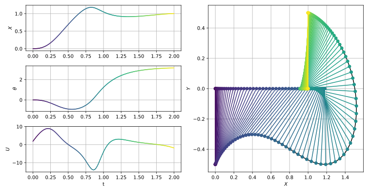
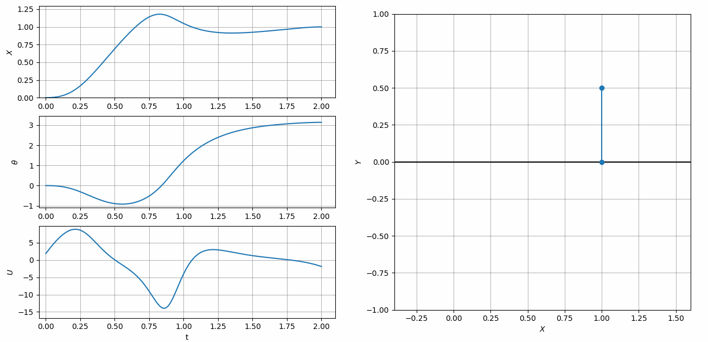

==================
Cart-Pole Swing Up
==================

In this example, derived from Kelly's excellent intro to collocation methods [1], we will compute the minimum effort trajectory to swing a cart-pole system to a vertical orientation. 
The cart with mass, :math:`m_1`, is free to move along a horizontal track in the :math:`x` direction subject to an applied force, :math:`F`. 
The angular position, :math:`\theta`, of the attached pole with length, :math:`l`, and mass, :math:`m_2`, is measured from the :math:`-y` direction. 
The dynamics of the combined cart-pole system can be represented as a system of first order ODE's as shown below.

.. math::
    
    \vec{X} = [x,\theta,\dot{x},\dot{\theta}]^T \quad \quad \vec{U} = [F]

    \dot{\vec{X}}=\begin{bmatrix}
                    \dot{x}\\
                    \dot{\theta}\\
                    \ddot{x}\\
                    \ddot{\theta}\\
                    \end{bmatrix}
                    = \begin{bmatrix}
                    \dot{x}\\
                    \dot{\theta}\\
                    \textbf{M}^{-1} \vec{Q}
                    \end{bmatrix}
                    
The matrix, :math:`\textbf{M}`, and vector, :math:`\vec{Q}`, necessary for computing the second time derivatives of :math:`x` and :math:`\theta`, can be found by straightforward
application of Newtonian or Lagrangian mechanics. 
Since :math:`\textbf{M}` is a 2 by 2 matrix it is easy to derive an explicit formula for :math:`\ddot{x}` and :math:`\ddot{\theta}` [1]. However, in this example, we leave the dynamics
in implicit matrix form in order to demonstrate ASSET's differentiable matrix inverse expressions.

.. math::

    \textbf{M} = \begin{bmatrix}
    \cos(\theta) & l \\
    m_1 +m_2 & m_2 l \cos(\theta)
    \end{bmatrix}
    \quad \quad
    \vec{Q} = \begin{bmatrix}
    -g \sin(\theta)  \\
    F + l m_2 \sin(\theta) \dot{\theta}^2
    \end{bmatrix}
    

The cart/pole masses, boundary conditions, and path constraints used by Kelly [1] are shown below.

.. math::

    m_1 = 1\;kg\quad\quad m_2 = .3\;kg\quad\quad l = .5\; m \quad \quad g = 9.81 \; m/s^2

.. math::
    
    x(0) = 0\; m \quad \quad \theta(0)  &= 0 \; rad   \quad \quad \dot{x}(0)&= 0\; m/s  \quad \quad \dot{\theta}(0)=0 \; rad/s

    x(1) = 1\; m \quad \quad \theta(1)  &= \pi \; rad   \quad \quad \dot{x}(1)&= 0\; m/s  \quad \quad \dot{\theta}(1)=0 \; rad/s

.. math::

    -2\;m \leq x(t)\leq 2\;m  \quad \quad   -20\;N \leq F(t)\leq 20\;N

The minimum effort trajectory is obtained by minimizing the integral of the square of the force applied to the cart.

.. math::

    J = \int_0^1 F(t)^2 \;dt

The cart-pole dynamics can be implemented as an ASSET ODE as shown below. Here we use ASSET's matrix functions to construct a row-major view of the coefficients of :math:`\textbf{M}`.
We can then invert this expression and multiply by :math:`\vec{Q}`, to define :math:`\ddot{x}` and :math:`\ddot{\theta}`.

.. code-block:: python

    class CartPole(oc.ODEBase):
    
        def __init__(self,l,m1,m2,g):
            Xvars = 4
            Uvars = 1
            ####################################################
            XtU = oc.ODEArguments(Xvars,Uvars)
        
            x,theta,xdot,thetadot = XtU.XVec().tolist()
            F = XtU.UVar(0)
        
            Q = vf.stack([-g*vf.sin(theta),
                            F+m2*l*vf.sin(theta)*thetadot**2])
        
            Mvec_rm = vf.stack(vf.cos(theta),l,
                                m1+m2,m2*l*vf.cos(theta))
        
            M = vf.RowMatrix(Mvec_rm,2,2)
        
            xddot_thetaddot = M.inverse()*Q
    
            ode = vf.stack([xdot,thetadot,xddot_thetaddot])
            ####################################################
            super().__init__(ode,Xvars,Uvars)
        

After implementing the ODE, we define a phase and apply our boundary conditions and integral objective function. The units and time scale of this problem are already well conditioned
and do not need any non-dimensionalization. Furthermore, it is sufficient to initialize the trajectory with a straight line initial guess between the fixed boundary conditions.

.. code-block:: python

    m1 = 1     # Mass of Cart kg
    m2 =.3     # Mass of Pole kg
    l  =.5     # Length of Pole m
    g = 9.81   # you already know m/s^2
    
    Fmax = 20  # N
    xmax = 2   # m
    
    tf  = 2    # s
    xf  = 1    # m       
    
    ts = np.linspace(0,tf,100)
    IG = [[xf*t/tf,np.pi*t/tf,0,0,t,.00] for t in ts]
    
    
    ode = CartPole(l,m1,m2,g)
    
    phase = ode.phase("LGL5",IG,64)
    #Fix first state (x,theta,xdot,thetadot) and time
    phase.addBoundaryValue("First",range(0,5),[0 ,0    , 0, 0, 0])
    #Fix last state (x,theta,xdot,thetadot) and time
    phase.addBoundaryValue("Last" ,range(0,5),[xf,np.pi, 0, 0, tf])
    # Bound control forces
    phase.addLUVarBound("Path",5,-Fmax,Fmax)
    phase.addLUVarBound("Path",0,-xmax,xmax)
    # Minimize the "control effort", the integral of square of applied force
    phase.addIntegralObjective(Args(1)[0]**2,[5])
    
    phase.setThreads(8,8)
    phase.optimizer.set_PrintLevel(1)
    phase.optimize()
    
    Traj = phase.returnTraj()

On a 6 core i7-9750H laptop, with 64 LGL5 segments, this problem converges in 12 iterations of the optimize algorithm taking only 28 milliseconds.
The final objective value is 58.80819. A plot and animation of the converged trajectory can be seen below.

References
##########
#. Kelly, M., 2017. An introduction to trajectory optimization: How to do your own direct collocation. SIAM Review, 59(4), pp.849-904.

Full-Code
#########

.. code-block:: python

    import numpy as np
    import asset_asrl as ast
    import matplotlib.pyplot as plt
    import seaborn as sns    # pip install seaborn if you dont have it
    import matplotlib.animation as animation

    vf = ast.VectorFunctions
    oc = ast.OptimalControl
    Args = vf.Arguments

    '''
    Example taken from 
    Kelly, M., 2017. An introduction to trajectory optimization: How to do your own direct collocation. SIAM Review, 59(4), pp.849-904.

    Compute the minimum effort trajectory to swing a cart pole system to vertical.
    The boundary conditions, dynamics and objective are the same as in the reference,
    but we use asset's matrix functions to invert the mass matrix at run-time rather than solving
    for the equations of motion explicitly.

    '''

    class CartPole(oc.ODEBase):
    
        def __init__(self,l,m1,m2,g):
            Xvars = 4
            Uvars = 1
            ####################################################
            XtU = oc.ODEArguments(Xvars,Uvars)
        
            x,theta,xdot,thetadot = XtU.XVec().tolist()
            F = XtU.UVar(0)
        
            Q = vf.stack([-g*vf.sin(theta),
                            F+m2*l*vf.sin(theta)*thetadot**2])
        
            Mvec_rm = vf.stack(vf.cos(theta),l,
                                m1+m2,m2*l*vf.cos(theta))
        
            M = vf.RowMatrix(Mvec_rm,2,2)
        
            xddot_thetaddot = M.inverse()*Q
    
            ode = vf.stack([xdot,thetadot,xddot_thetaddot])
            ####################################################
            super().__init__(ode,Xvars,Uvars)
        
    ###############################################################################

    def Plot(Traj):
    
        T = np.array(Traj).T
    
    
        P0X = T[0]
        P0Y = np.zeros_like(T[0])
        P1X  = T[0] + l*np.sin(T[1])
        P1Y  = -l*np.cos(T[1])
    
        n = len(P0X)
    
        cols=sns.color_palette("viridis",n)
    
        fig = plt.figure()
        ax0 = plt.subplot(321)
        ax1 = plt.subplot(323)
        ax2 = plt.subplot(325)
        ax3 = plt.subplot(122)
    
        axs = [ax0,ax1,ax2]
    
        for i, var in enumerate([0,1,5]):
            for j in range(0,len(T[0])-1):
                axs[i].plot(T[4][j:j+2],T[var][j:j+2],color=cols[j])
    
    
    
        ax3.plot(P0X,P0Y,color='k')
        ax3.plot(P1X,P1Y,color='k')
    
        for i in range(0,n):
            xs = [P0X[i],P1X[i]]
            ys = [P0Y[i],P1Y[i]]
            ax3.plot(xs,ys,color=cols[i],marker='o')
      
        ax0.grid(True)
        ax1.grid(True)
        ax2.grid(True)
        ax3.grid(True)
    
        ax0.set_ylabel(r'$X$')
        ax1.set_ylabel(r'$\theta$')
        ax2.set_ylabel(r'$U$')
        ax2.set_xlabel(r't')
    
        ax3.set_xlabel(r'$X$')
        ax3.set_ylabel(r'$Y$')
        fig.set_size_inches(10.5, 5.5, forward=True)
    
        fig.set_tight_layout(True)
        plt.show()

    def Animate(Traj):
        T = np.array(Traj).T
    
    
        P0X = T[0]
        P0Y = np.zeros_like(T[0])
        P1X  = T[0] + l*np.sin(T[1])
        P1Y  = -l*np.cos(T[1])
    
        n = len(P0X)
        fig = plt.figure()
    
        ax0 = plt.subplot(321,xlim=(-.05, max(T[4])*1.05), ylim=(min(T[0])*1.2, max(T[0])*1.1))
        ax1 = plt.subplot(323,xlim=(-.05, max(T[4])*1.05), ylim=(min(T[1])*1.2, max(T[1])*1.1))
        ax2 = plt.subplot(325,xlim=(-.05, max(T[4])*1.05), ylim=(min(T[5])*1.2, max(T[5])*1.1))    
        ax3 = fig.add_subplot(122, aspect='equal',xlim=(-.4, 1.6), ylim=(-1.0, 1.0))

        ax3.grid(True)
    
        ax3.plot([-2,2],[0,0],color='k')

        pole, = ax3.plot([],[],marker="o")
        X, =ax0.plot([],[])
        theta, =ax1.plot([],[])
        U, =ax2.plot([],[])

        def init():
            pole.set_data([],[])
            U.set_data([],[])
            X.set_data([],[])
            theta.set_data([],[])
            return pole,X,theta,U

        def animate(i):
            xs = [P0X[i],P1X[i]]
            ys = [P0Y[i],P1Y[i]]
            pole.set_data(xs,ys)
            X.set_data(T[4][0:i+1],T[0][0:i+1])
            theta.set_data(T[4][0:i+1],T[1][0:i+1])
            U.set_data(T[4][0:i+1],T[5][0:i+1])
        
            return pole,X,theta,U

        ani = animation.FuncAnimation(fig, animate, frames=len(P0X),
                                      interval=60, blit=True, init_func=init,
                                      repeat_delay=5000)

        ax0.grid(True)
        ax1.grid(True)
        ax2.grid(True)
        ax3.grid(True)
    
        ax0.set_ylabel(r'$X$')
        ax1.set_ylabel(r'$\theta$')
        ax2.set_ylabel(r'$U$')
        ax2.set_xlabel(r't')
        ax3.set_xlabel(r'$X$')
        ax3.set_ylabel(r'$Y$')
        fig.set_size_inches(15.5, 7.5, forward=True)

        plt.show()
    

    ##############################################################################        
        
    if __name__ == "__main__":
            
        m1 = 1     # Mass of Cart kg
        m2 =.3     # Mass of Pole kg
        l  =.5     # Length of Pole m
        g = 9.81   # you already know m/s^2
    
        Fmax = 20  # N
        xmax = 2   # m
    
        tf  = 2    # s
        xf  = 1    # m       
    
        ts = np.linspace(0,tf,100)
        IG = [[xf*t/tf,np.pi*t/tf,0,0,t,.00] for t in ts]
    
    
        ode = CartPole(l,m1,m2,g)
    
        phase = ode.phase("LGL5",IG,64)
        #Fix first state (x,theta,xdot,thetadot) and time
        phase.addBoundaryValue("First",range(0,5),[0 ,0    , 0, 0, 0])
        #Fix last state (x,theta,xdot,thetadot) and time
        phase.addBoundaryValue("Last" ,range(0,5),[xf,np.pi, 0, 0, tf])
        # Bound control forces
        phase.addLUVarBound("Path",5,-Fmax,Fmax)
        phase.addLUVarBound("Path",0,-xmax,xmax)
        # Minimize the "control effort", the integral of square of applied force
        phase.addIntegralObjective(Args(1)[0]**2,[5])
    
        phase.setThreads(8,8)
        phase.optimizer.set_PrintLevel(1)
        phase.optimize()
    
        Traj = phase.returnTraj()

    
        
        ## Example of how to get exact timing statistics should you need to
        print("Total Time (Sum of all below)             :",phase.optimizer.LastTotalTime," s")
        print("Function/Derivative Eval Time             :",phase.optimizer.LastFuncTime," s")
        print("KKT Matrix Factor/Solve Time              :",phase.optimizer.LastKKTTime," s")
        print("KKT Matrix Pre-Analysis/Mem Alloc Time    :",phase.optimizer.LastPreTime," s")
        print("Miscellaneous (Mostly Console Print) Time :",phase.optimizer.LastMiscTime," s")
    
    
   
        Plot(Traj)
        Animate(Traj)

        ###########################################################################

