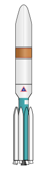
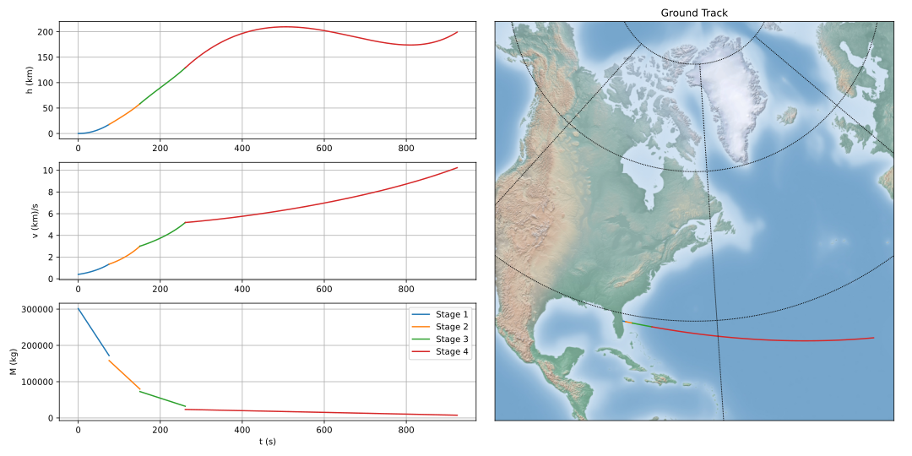

Delta 3 Multi-phase GTO Transfer
================================

    
    Delta 3 Rocket.

    Courtesy W. D. Graham.

As an example of a multi-phase optimal control problem, we will optimize the launch and 
geostationary transfer orbit insertion of a Delta 3 rocket as described by Betts in [1].

..  note:: 

    We should note that this example is derived entirely from publicly available sources (see [1-4]). Furthermore, this problem is routinely 
    used [1-4] as a benchmark for generic multi-phase optimal control packages such as ASSET.

The Delta 3 was nominally a 2 stage rocket consisting of a first stage RS-27A and 9 solid rocket boosters topped with an RL-10 upper stage. The rocket had an interesting staging
strategy with the first stage liquid engine and only 6 of the 9 SRBs igniting at take off. Following burnout of these 6 solid rocket 
boosters 75.2 seconds after launch, the inert mass is ejected and the remaining 3 boosters are ignited. After another 75.2 seconds (t+150.4s) these 3 SRBs
too are ejected and the first stage continues to burn until t+261s.
At this point the RL-10 upper stage and payload separate from the first stage and continue to orbit, burning for up to an additional 700 seconds. 

Betts' problem in [1] involves maximizing the mass delivered to a pre-specified geostationary orbit for a launch from cape Canaveral. 
This problem can be broken down into 4 phases: 

    1. 6 SRBs + First Stage   (  0.0  <= t <=  75.2s)
    2. 3 SRBs + First Stage   ( 75.2s <= t <= 150.4s)
    3. First Stage            (150.4s <= t <= 261.0s)
    4. Second Stage.          (261.0s <= t <= 961.0s)

The dynamics on each of the four phases are expressed in Cartesian coordinates 
and are all the same save for differing values for the combined thrust and mass flow-rate of the currently burning engine configurations.
The thrust (:math:`T_i`) , and mass flow rate (:math:`\dot{m}_i`), and inert masses for stages can be found in [1] and in our example script.

.. math::

    \dot{\vec{r}} &= \vec{v}

    \dot{\vec{v}} &= -\frac{\mu}{r^3}\vec{r} +  \frac{T_i\hat{u} + \vec{D}}{m}

    \dot{m}       &= -\dot{m}_i
   

.. math::
    \vec{D} &= \frac{1}{2}C_D S \rho |\vec{v}_r|\vec{v_r}

    \vec{v}_r &= \vec{v} + \vec{r}\times\vec{\omega}_e

    \rho  &= \rho_0 e^{-h/h_0}

    h  &= |\vec{r}| - R_e

Initial conditions applied to the first phase enforce that the rocket depart from the Cape's latitude 
with zero velocity relative to the surface of the Earth.

.. math::

    \vec{r}(0) &= [\cos(28.5^\circ),0,\sin(28.5^\circ)]^T

    \vec{v}(0) &= -\vec{r}\times\vec{\omega}_e

Terminal conditions applied to the final phase enforce that the rocket 
insert into a geostationary transfer orbit with the following classical orbital elements.

.. math::

    a(t_f) &= 24361140 \;km

    e(t_f) &= .7308

    i(t_f) &= 28.5^\circ

    \omega(t_f) &= 130.5 ^\circ

    \Omega(t_f) &= 269.8 ^\circ

Modeling this problem in ASSET starts with defining the dynamics for each phase. Since the structure of the dynamics is the same for
all 4 phases, we can model them with a single ASSET ODE given below.

.. code-block:: python

    class RocketODE(oc.ODEBase):
        def __init__(self,T,mdot):
            ####################################################
            XtU  = oc.ODEArguments(7,3)
        
            R = XtU.XVec().head3()
            V = XtU.XVec().segment3(3)
            m = XtU.XVar(6)
        
            # We normalize the control direction in the dynamics so it doesnt have
            # to be done as a path constraint
            u = XtU.UVec().normalized()
        
            h       = R.norm() - Re
            rho     = RhoAir * vf.exp(-h / h_scale)
            Vr      = V + R.cross(np.array([0,0,We]))
        
            ## We cant let let Vr be exactly 0, derivative of norm of 0 vector is NAN
            ## Will handle this in inititial conditions
            D       = (-0.5*CD*S)*rho*(Vr*Vr.norm())
        
            Rdot    =  V
            Vdot    =  (-mu)*R.normalized_power3() + (T*u + D)/m
        
            ode = vf.stack(Rdot,Vdot,-mdot)
            ####################################################
            super().__init__(ode,7,3)

As you might have noticed, our model is written in Cartesian coordinates, but our terminal boundary conditions on the final phase are given 
as a set of classical orbital elements. This necessitates writing a custom constraint (below), which will convert from Cartesian coordinates to 
orbital elements so that we can target the given orbit. Those familiar with this conversion will know that it requires quadrant checks on the RAAN
and argument of periapse, and thus requires a run-time conditional statement. Such simple conditional statements can be readily handled in ASSET's VectorFunction type system,
using the :code:`vf.ifelse` function as seen below. The first argument of the function is a conditional statement containing at least one ASSET VectorFunction. 
At run time, if this statement, evaluates to True, output of the function will be given by the second argument, 
and if it evaluates to :code:`False` , the output will be the final argument.

.. code-block:: python

    def TargetOrbit(at,et,it, Ot,Wt):
        R,V = Args(6).tolist([(0,3),(3,3)])
    
        r    = R.norm()
        v    = V.norm()
    
        #Angular momentum vector
        hvec = R.cross(V)
    
        #Node vector
        nvec = vf.cross([0,0,1],hvec)
    
        # Energy
        eps = 0.5*(v**2) - mu/r
    
        # Semi-major axis
        a =  -0.5*mu/eps
    
        evec = V.cross(hvec)/mu - R.normalized()
        #Eccentrcity
        e = evec.norm()
    
        #inclination
        i = vf.arccos(hvec.normalized()[2]) 
    
        #RAAN
        O = vf.arccos(nvec.normalized()[0])
        # Quadrant Check
        O = vf.ifelse(nvec[1]>0,O,2*np.pi -O)
    
        # Argument of periapse
        W = vf.arccos(nvec.normalized().dot(evec.normalized()))
        #QuadrantCheck
        W = vf.ifelse(evec[2]>0,W,2*np.pi-W)
    
        return vf.stack([a,e,i,O,W]) - np.array([at,et,it,Ot,Wt])

With our dynamics and custom boundary constraint defined we can now begin the task of setting up and solving the problem.

Our first step here will be to find a suitable initial guess for all four phases of the rockets flight as shown below. To do this, we adopt a similar
strategy to Betts of selecting a state along the target orbit, and linearly interpolating from our known initial conditions. We roughly select this terminal state
such that the linearly interpolated initial guess departs the cape in an easterly direction and does not pass under the surface of the Earth. 
This initial guess is evenly partitioned in time to construct the position and velocity along each phase. 
Because the dynamics do not allow throttling of the engine, we can also supply the exact mass history for each phase. 
The thrust directions are arbitrarily set to the unit y direction.

.. code-block:: python

    # Target orbital elements
    at     = 24361140 /Lstar
    et     = .7308
    Ot     = np.deg2rad(269.8)
    Wt     = np.deg2rad(130.5)
    istart = np.deg2rad(28.5)
    
    
    y0      = np.zeros((6))
    y0[0:3] = np.array([np.cos(istart),0,np.sin(istart)])*Re
    y0[3:6] =-np.cross(y0[0:3],np.array([0,0,We]))
    y0[3]  += 0.00001/Vstar  # cant be exactly zero,our drag equation's derivative would NAN !!!
    
    
    ## MF is the only magic number in the script, just trying to find
    ## a mean anomaly such that the terminal state on the orbit is downrange
    ## eastward from KSC in and doesnt pass through earth when LERPed from KSC
    MF   =-.05
    OEF  = [at,et,istart,Ot,Wt,MF]
    yf   = ast.Astro.classic_to_cartesian(OEF,mu)
    
    ts   = np.linspace(0,tf_phase4,1000)
    
    IG1 =[]
    IG2 =[]
    IG3 =[]
    IG4 =[] 
    
    
    for t in ts:
        X = np.zeros((11))
        X[0:6]= y0 + (yf-y0)*(t/ts[-1])
        X[7]  = t
        X[8:11]= np.array([0,1,0])
        if(t<tf_phase1):
            m= m0_phase1 + (mf_phase1-m0_phase1)*(t/tf_phase1)
            X[6]=m
            IG1.append(X)
        elif(t<tf_phase2):
            m= m0_phase2 + (mf_phase2-m0_phase2)*(( t-tf_phase1) / (tf_phase2 - tf_phase1))
            X[6]=m
            IG2.append(X)
        elif(t<tf_phase3):
            m= m0_phase3 + (mf_phase3-m0_phase3)*(( t-tf_phase2) / (tf_phase3 - tf_phase2))
            X[6]=m
            IG3.append(X)
        elif(t<tf_phase4):
            m= m0_phase4 + (mf_phase4-m0_phase4)*(( t-tf_phase3) / (tf_phase4 - tf_phase3))
            X[6]=m
            IG4.append(X)
   

Now we can instantiate (below), the ODE's and phases for each of the 4 rocket stages and combine them into a single optimal control problem. 
On the first phase we apply our known initial state, time, and mass as a boundary value. The length of the phase is then enforced by fixing the
final time of the last state to be equal to the burnout time of the first 6 SRB's. 
The initial position, velocity, and time of phases 2 and 3 will be dictated by later continuity constraints, 
so along these phases we only need to explicitly enforce the known initial mass and burnout times given in the problem statement. 
In :code:`phase4`, since the final burnout time of the final stage is not known, we simply place the upper bound to be the time at which all propellant would have been expended.
Additionally, it is to this phase that we apply our terminal constraint on the target orbit, and our objective to maximize final mass. 

Finally, we combine these 4 phases into a single optimal control problem and add a link constraint that enforces position, velocity, 
and time continuity between sequential phases. 
We then run :code:`solve_optimize()` on the problem with the line search enabled and return the solution for plotting.

.. code-block:: python

    ode1 = RocketODE(T_phase1,mdot_phase1)
    ode2 = RocketODE(T_phase2,mdot_phase2)
    ode3 = RocketODE(T_phase3,mdot_phase3)
    ode4 = RocketODE(T_phase4,mdot_phase4)
    
    tmode = "LGL3"
    cmode = "HighestOrderSpline"
    
    nsegs1 = 40
    nsegs2 = 40
    nsegs3 = 40
    nsegs4 = 40
    
    #########################################
    phase1 = ode1.phase(tmode,IG1,nsegs1)
    phase1.setControlMode(cmode)
    
    ## Thrust direction is normalized in dynamics, so we dont
    ## have to enforce norm of 1 on controls. For good measure,
    ## we do bound the magnitude to prevent it from becoming too large or small
    phase1.addLUNormBound("Path",[8,9,10],.5,1.5)
    phase1.addBoundaryValue("Front",range(0,8),IG1[0][0:8])
    
    #Dont want our bound to interfere with initial condition which starts at Re
    #so i relax the Earth radius constraint slightly here
    phase1.addLowerNormBound("Path",[0,1,2],Re*.999999)
    phase1.addBoundaryValue("Back",[7],[tf_phase1])
    
    #########################################
    phase2 = ode2.phase(tmode,IG2,nsegs2)
    phase2.setControlMode(cmode)
    
    phase2.addLowerNormBound("Path",[0,1,2],Re)
    phase2.addLUNormBound("Path",[8,9,10],.5,1.5)
    
    ## Fixing initial mass and final time on first 3 phases.
    ## Since the engine cant be throttled, constraining final mass
    ## as well would be redundant and over-constrained
    phase2.addBoundaryValue("Front",[6], [m0_phase2])
    phase2.addBoundaryValue("Back", [7] ,[tf_phase2])
    
    #########################################
    phase3 = ode3.phase(tmode,IG3,nsegs3)
    phase3.setControlMode(cmode)
    
    phase3.addLowerNormBound("Path",[0,1,2],Re)
    phase3.addLUNormBound("Path",[8,9,10],.5,1.5)
    phase3.addBoundaryValue("Front",[6], [m0_phase3])
    phase3.addBoundaryValue("Back", [7] ,[tf_phase3])
    
    #########################################
    phase4 = ode4.phase(tmode,IG4,nsegs4)
    phase4.setControlMode(cmode)

    phase4.addLowerNormBound("Path",[0,1,2],Re)
    phase4.addLUNormBound("Path",[8,9,10],.5,1.5)
    phase4.addBoundaryValue("Front",[6], [m0_phase4])
    phase4.addUpperVarBound("Back",7,tf_phase4,1.0)
    phase4.addEqualCon("Back",TargetOrbit(at,et,istart,Ot,Wt),range(0,6))
    # Maximize final mass
    phase4.addValueObjective("Back",6,-1.0)
    
    #########################################
    
    ocp = oc.OptimalControlProblem()
    ocp.addPhase(phase1)
    ocp.addPhase(phase2)
    ocp.addPhase(phase3)
    ocp.addPhase(phase4)
    
    ## All phases continuous in everything but mass (var 6)
    ocp.addForwardLinkEqualCon(phase1,phase4,[0,1,2,3,4,5, 7,8,9,10])
    
    
    ocp.optimizer.set_OptLSMode("L1")
    ocp.optimizer.set_SoeLSMode("L1")
    ocp.optimizer.set_MaxLSIters(2)
    ocp.optimizer.set_PrintLevel(1)

    ocp.solve_optimize()
    

    Phase1Traj = phase1.returnTraj()  # or ocp.Phase(i).returnTraj()
    Phase2Traj = phase2.returnTraj()
    Phase3Traj = phase3.returnTraj()
    Phase4Traj = phase4.returnTraj()
    
    
    print("Final Mass = ",Phase4Traj[-1][6]*Mstar,' kg')

    Plot(Phase1Traj,Phase2Traj,Phase3Traj,Phase4Traj)

On an intel i9-12900k ,using 160 LGL3 segments across all 4 phases, this problem solves in approximately 60 milliseconds.
The altitude, velocity and mass of the rocket as function of time are plotted below along with a ground-track of the trajectory. 
Final Mass Delivered to the GTO is 7529.749kg, which is effectively the same as that given by Betts (7529.712 kg).

References
##########
#. Betts, J.T. "Practical methods for Optimal Control and Estimation Using Nonlinear Programming", Cambridge University Press, 2009
#. Agamawi, Y. M., & Rao, A. V. (2020). Cgpops: A c++ software for solving multiple-phase optimal control problems using adaptive gaussian quadrature collocation and sparse nonlinear programming. ACM Transactions on Mathematical Software (TOMS), 46(3), 1-38.
#. Patterson, M. A., & Rao, A. V. (2014). GPOPS-II: A MATLAB software for solving multiple-phase optimal control problems using hp-adaptive Gaussian quadrature collocation methods and sparse nonlinear programming. ACM Transactions on Mathematical Software (TOMS), 41(1), 1-37.
#. Benson, D. (2005). A Gauss pseudospectral transcription for optimal control (Doctoral dissertation, Massachusetts Institute of Technology).

Full Code
#########

.. code-block:: python

    import numpy as np
    import asset_asrl as ast
    import matplotlib.pyplot as plt
    from mpl_toolkits.basemap import Basemap ## PIP INSTALL Basemap if you dont have it

    vf        = ast.VectorFunctions
    oc        = ast.OptimalControl
    Args      = vf.Arguments

    ############################################################################

    g0      =  9.80665 
    Lstar   =  6378145           ## m   Radius of Earth
    Tstar   =  961.0             ## sec Engine Burn Time
    Mstar   =  301454.0          ## kgs Inital Mass of Rocket

    Astar   =  Lstar/Tstar**2
    Vstar   =  Lstar/Tstar
    Rhostar =  Mstar/Lstar**3
    Estar   =  Mstar*(Vstar**2)
    Mustar  =  (Lstar**3)/(Tstar**2)
    Fstar   =  Astar*Mstar
    #############################################################################

    mu      = 3.986012e14      /Mustar
    Re      = 6378145          /Lstar
    We      = 7.29211585e-5    *Tstar

    RhoAir  = 1.225        /Rhostar
    h_scale = 7200         /Lstar
    g       = g0           /Astar

    CD = .5
    S  = 4*np.pi   /Lstar**2

    TS = 628500      /Fstar
    T1 = 1083100     /Fstar
    T2 = 110094      /Fstar

    IS = 283.33364   /Tstar
    I1 = 301.68      /Tstar
    I2 = 467.21       /Tstar

    tS = 75.2        /Tstar
    t1 = 261         /Tstar
    t2 = 700         /Tstar

    TMS = 19290      /Mstar
    TM1 = 104380     /Mstar
    TM2 = 19300      /Mstar
    TMPay = 4164     /Mstar

    PMS = 17010     /Mstar
    PM1 = 95550     /Mstar
    PM2 = 16820     /Mstar

    SMS = TMS - PMS
    SM1 = TM1 - PM1
    SM2 = TM2 - PM2

    T_phase1 = 6*TS + T1
    T_phase2 = 3*TS + T1
    T_phase3 = T1
    T_phase4 = T2

    mdot_phase1 = (6*TS/IS + T1/I1)/g
    mdot_phase2 = (3*TS/IS + T1/I1)/g
    mdot_phase3 = T1/(g*I1)
    mdot_phase4 = T2/(g*I2)

    tf_phase1 = tS
    tf_phase2 = 2*tS
    tf_phase3 = t1
    tf_phase4 = t1+t2

    m0_phase1 = 9*TMS + TM1 + TM2 + TMPay
    mf_phase1 = m0_phase1 - 6*PMS - (tS/t1)*PM1

    m0_phase2 = mf_phase1 - 6*SMS
    mf_phase2 = m0_phase2 - 3*PMS - (tS/t1)*PM1

    m0_phase3 = mf_phase2 - 3*SMS
    mf_phase3 = m0_phase3 - (1 - 2*tS/t1)*PM1

    m0_phase4 = mf_phase3 - SM1
    mf_phase4 = m0_phase4 - PM2

    #############################################################################
    class RocketODE(oc.ODEBase):
        def __init__(self,T,mdot):
            ####################################################
            XtU  = oc.ODEArguments(7,3)
        
            R = XtU.XVec().head3()
            V = XtU.XVec().segment3(3)
            m = XtU.XVar(6)
        
            # We normalize the control direction in the dynamics so it doesnt have
            # to be done as a path constraint
            u = XtU.UVec().normalized()
        
            h       = R.norm() - Re
            rho     = RhoAir * vf.exp(-h / h_scale)
            Vr      = V + R.cross(np.array([0,0,We]))
        
            ## We cant let let Vr be exactly 0, derivative of norm of 0 vector is NAN
            ## Will handle this in inititial conditions
            D       = (-0.5*CD*S)*rho*(Vr*Vr.norm())
        
            Rdot    =  V
            Vdot    =  (-mu)*R.normalized_power3() + (T*u + D)/m
        
            ode = vf.stack(Rdot,Vdot,-mdot)
            ####################################################
            super().__init__(ode,7,3)

    def TargetOrbit(at,et,it, Ot,Wt):
        R,V = Args(6).tolist([(0,3),(3,3)])
    
        r    = R.norm()
        v    = V.norm()
    
        #Angular momentum vector
        hvec = R.cross(V)
    
        #Node vector
        nvec = vf.cross([0,0,1],hvec)
    
        # Energy
        eps = 0.5*(v**2) - mu/r
    
        # Semi-major axis
        a =  -0.5*mu/eps
    
        evec = V.cross(hvec)/mu - R.normalized()
        #Eccentrcity
        e = evec.norm()
    
        #inclination
        i = vf.arccos(hvec.normalized()[2]) 
    
        #RAAN
        O = vf.arccos(nvec.normalized()[0])
        # Quadrant Check
        O = vf.ifelse(nvec[1]>0,O,2*np.pi -O)
    
        # Argument of periapse
        W = vf.arccos(nvec.normalized().dot(evec.normalized()))
        #QuadrantCheck
        W = vf.ifelse(evec[2]>0,W,2*np.pi-W)
    
        return vf.stack([a,e,i,O,W]) - np.array([at,et,it,Ot,Wt])
    
    ###############################################################################

    def Plot(Phase1,Phase2,Phase3,Phase4):
        ############################################

        def LatLongAlt(Traj):
            LLs = []
            for T in Traj:
                x = T[0]
                y = T[1]
                z = T[2]
                r   = np.linalg.norm(T[0:3])
            
                lat = np.rad2deg(np.arcsin(z/r))
            
                long = np.rad2deg(np.arctan2(y,x))
                if(x>0):long+=0
                elif(y>0):long+=180
                else:long-=180
                LLs.append([lat,long-80.649]) 
            return LLs

        def AltVelMass(Traj):
            Xs =[]
            for T in Traj:
                r   = np.linalg.norm(T[0:3])
                alt = (r-Re)*Lstar/1000
                v = np.linalg.norm(T[3:6])*Vstar/1000
                m = T[6]*Mstar
                t = T[7]*Tstar
                Xs.append([alt,v,m,t])
            
            return np.array(Xs).T

        LLs = LatLongAlt([Phase1[0],Phase2[0],Phase3[0],Phase4[0],Phase4[-1]])
            
        P1 = AltVelMass(Phase1)
        P2 = AltVelMass(Phase2)
        P3 = AltVelMass(Phase3)
        P4 = AltVelMass(Phase4)

        fig = plt.figure()
        ax0 = plt.subplot(321)
        ax1 = plt.subplot(323)
        ax2 = plt.subplot(325)
        ax3 = plt.subplot(122)    

        ax0.grid(True)
        ax1.grid(True)
        ax2.grid(True)

        ax0.set_ylabel("h (km)")
        ax1.set_ylabel("v (km)/s")
        ax2.set_ylabel("M (kg)")
        ax2.set_xlabel("t (s)")

        PS = [P1,P2,P3,P4]

        for i,P in enumerate(PS):
            s = i+1
            ax0.plot(P[3],P[0])
            ax1.plot(P[3],P[1])
            ax2.plot(P[3],P[2],label=f'Stage {s}')

    
        m = Basemap(projection='lcc',
                    lat_1=45.,lat_2=55,lat_0=50,lon_0=-65.,
                    resolution=None,width=9000000,height=9000000,ax=ax3)

        for i in range(0,len(LLs)-1):
            lon1 = float(LLs[i][1])
            lat1 = float(LLs[i][0])
            lon2 = float(LLs[i+1][1])
            lat2 = float(LLs[i+1][0])
            m.drawgreatcircle(lon1=lon1,lat1=lat1,lon2=lon2,lat2=lat2)

        ax2.legend()
        #m.bluemarble()
        m.shadedrelief()

        m.drawparallels(np.arange(-90.,91.,30.))
        m.drawmeridians(np.arange(-180.,181.,60.))
        #m.drawmapboundary(fill_color='aqua')
        plt.title("Ground Track")
    
        fig.set_size_inches(15.0, 7.5, forward=True)
        fig.tight_layout()

        plt.show()

    ###############################################################################

    if __name__ == "__main__":

        ast.SoftwareInfo()
    
    
        # Target orbital elements
        at     = 24361140 /Lstar
        et     = .7308
        Ot     = np.deg2rad(269.8)
        Wt     = np.deg2rad(130.5)
        istart = np.deg2rad(28.5)
    
    
        y0      = np.zeros((6))
        y0[0:3] = np.array([np.cos(istart),0,np.sin(istart)])*Re
        y0[3:6] =-np.cross(y0[0:3],np.array([0,0,We]))
        y0[3]  += 0.00001/Vstar  # cant be exactly zero,our drag equation's derivative would NAN !!!
    
    
        ## MF is the only magic number in the script, just trying to find
        ## a mean anomaly such that the terminal state on the orbit is downrange
        ## eastward from KSC in and doesnt pass through earth when LERPed from KSC
        MF   =-.05
        OEF  = [at,et,istart,Ot,Wt,MF]
        yf   = ast.Astro.classic_to_cartesian(OEF,mu)
    
        ts   = np.linspace(0,tf_phase4,1000)
    
        IG1 =[]
        IG2 =[]
        IG3 =[]
        IG4 =[] 
    
    
        for t in ts:
            X = np.zeros((11))
            X[0:6]= y0 + (yf-y0)*(t/ts[-1])
            X[7]  = t
            X[8:11]= np.array([0,1,0])
            if(t<tf_phase1):
                m= m0_phase1 + (mf_phase1-m0_phase1)*(t/tf_phase1)
                X[6]=m
                IG1.append(X)
            elif(t<tf_phase2):
                m= m0_phase2 + (mf_phase2-m0_phase2)*(( t-tf_phase1) / (tf_phase2 - tf_phase1))
                X[6]=m
                IG2.append(X)
            elif(t<tf_phase3):
                m= m0_phase3 + (mf_phase3-m0_phase3)*(( t-tf_phase2) / (tf_phase3 - tf_phase2))
                X[6]=m
                IG3.append(X)
            elif(t<tf_phase4):
                m= m0_phase4 + (mf_phase4-m0_phase4)*(( t-tf_phase3) / (tf_phase4 - tf_phase3))
                X[6]=m
                IG4.append(X)
        
    
    
        ode1 = RocketODE(T_phase1,mdot_phase1)
        ode2 = RocketODE(T_phase2,mdot_phase2)
        ode3 = RocketODE(T_phase3,mdot_phase3)
        ode4 = RocketODE(T_phase4,mdot_phase4)
    
        tmode = "LGL3"
        cmode = "HighestOrderSpline"
    
        nsegs1 = 40
        nsegs2 = 40
        nsegs3 = 40
        nsegs4 = 40
    
        #########################################
        phase1 = ode1.phase(tmode,IG1,nsegs1)
        phase1.setControlMode(cmode)
    
        ## Thrust direction is normalized in dynamics, so we dont
        ## have to enforce norm of 1 on controls. For good measure,
        ## we do bound the maginitude to prevent it from becoming too large or small
        phase1.addLUNormBound("Path",[8,9,10],.5,1.5)
        phase1.addBoundaryValue("Front",range(0,8),IG1[0][0:8])
    
        #Dont want our bound to interfere with initial condition which starts at Re
        #so i relax the Earth radius constraint slightly here
        phase1.addLowerNormBound("Path",[0,1,2],Re*.999999)
        phase1.addBoundaryValue("Back",[7],[tf_phase1])
    
        #########################################
        phase2 = ode2.phase(tmode,IG2,nsegs2)
        phase2.setControlMode(cmode)
    
        phase2.addLowerNormBound("Path",[0,1,2],Re)
        phase2.addLUNormBound("Path",[8,9,10],.5,1.5)
    
        ## Fixing initial mass and final time on first 3 phases.
        ## Since the engine cant be throttled, constraining final mass
        ## as well would be redundant and overconstrained
        phase2.addBoundaryValue("Front",[6], [m0_phase2])
        phase2.addBoundaryValue("Back", [7] ,[tf_phase2])
    
        #########################################
        phase3 = ode3.phase(tmode,IG3,nsegs3)
        phase3.setControlMode(cmode)
    
        phase3.addLowerNormBound("Path",[0,1,2],Re)
        phase3.addLUNormBound("Path",[8,9,10],.5,1.5)
        phase3.addBoundaryValue("Front",[6], [m0_phase3])
        phase3.addBoundaryValue("Back", [7] ,[tf_phase3])
    
        #########################################
        phase4 = ode4.phase(tmode,IG4,nsegs4)
        phase4.setControlMode(cmode)

        phase4.addLowerNormBound("Path",[0,1,2],Re)
        phase4.addLUNormBound("Path",[8,9,10],.5,1.5)
        phase4.addBoundaryValue("Front",[6], [m0_phase4])
        phase4.addUpperVarBound("Back",7,tf_phase4,1.0)
        phase4.addEqualCon("Back",TargetOrbit(at,et,istart,Ot,Wt),range(0,6))
        # Maximize final mass
        phase4.addValueObjective("Back",6,-1.0)
    
        #########################################
    
        ocp = oc.OptimalControlProblem()
        ocp.addPhase(phase1)
        ocp.addPhase(phase2)
        ocp.addPhase(phase3)
        ocp.addPhase(phase4)
    
        ## All phases continuous in everything but mass (var 6)
        ocp.addForwardLinkEqualCon(phase1,phase4,[0,1,2,3,4,5, 7,8,9,10])
    
    
        ocp.optimizer.set_OptLSMode("L1")
        ocp.optimizer.set_SoeLSMode("L1")
        ocp.optimizer.set_MaxLSIters(2)
        ocp.optimizer.set_PrintLevel(1)

        ocp.solve_optimize()
        #########################################
    
    
        Phase1Traj = phase1.returnTraj()  # or ocp.Phase(i).returnTraj()
        Phase2Traj = phase2.returnTraj()
        Phase3Traj = phase3.returnTraj()
        Phase4Traj = phase4.returnTraj()
    
    
        print("Final Mass = ",Phase4Traj[-1][6]*Mstar,' kg')

        Plot(Phase1Traj,Phase2Traj,Phase3Traj,Phase4Traj)

    