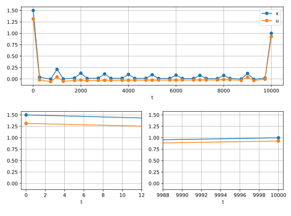
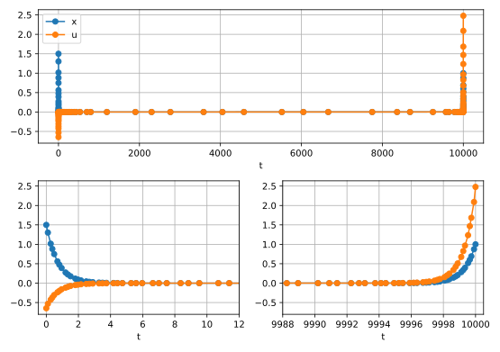

Hyper-Sensitive Optimal Control Problem
=======================================
In this example, we will leverage ASSET's adaptive mesh refinement capabilities to solve the
hyper sensitive optimal control problem [1]. The dynamics for this problem are a simple linear ODE
with one state variable and one control variable.

.. math::
    
    \vec{X} = [x] \quad \quad \vec{U} = [u]

    \dot{\vec{X}}=\begin{bmatrix}
                    -x + u
                    \end{bmatrix}

For this system we seek to minimize the quadratic integral objective shown below.

.. math::
    
    J = \frac{1}{2}\int_0^{t_f}x^2 + u^2 \;dt

Additionally, the following boundary conditions are applied to the state variable at :math:`t = 0` and some final time :math:`t_f`.

.. math::
    x(0) = 1.5 \quad\quad x(t_f) =1.0

This optimal control problem exhibits interesting behavior, where the state and control variables are non-zero near :math:`t=0`,
rapidly decay to 0, and then change suddenly near :math:`t=t_f` [1]. For large values of :math:`t_f`, this hypersensitive behavior is very difficult
to approximate using an evenly spaced collocation mesh, necessitating the usage of an adaptive mesh refinement scheme. In this example, we will use :math:`t_f=10000` 
as shown in [1].

The dynamics for the problem can be implemented in ASSET as shown below.

.. code-block:: python

    class HyperSens(oc.ODEBase):
        def __init__(self):
            ################################
            XtU  = oc.ODEArguments(1,1)
            x    = XtU.XVar(0)
            u    = XtU.UVar(0)
            xdot = -(x) + u
            ################################
            super().__init__(xdot,1,1)

Initial setup for the problem proceeds similarly to what has been shown in many previous examples and tutorials. For the initial guess
we linearly interpolate between our known boundary conditions over the fixed time horizon. We then construct our phase with this initial
guess, and apply the boundary constraints on the states and times. The objective is then specified as an integral objective. Loose bounds are also placed
on the state and control variables.  Additionally, we enable line searches and change the optimizer's fill-in reducing ordering to the Minimum Degree algorithm.
In our limited experience, the :code:`"MINDEG"` ordering, while resulting in slower factorizations than the default :code:`"METIS"` one, produces much more stable factorizations for
sensitive problems. 

.. code-block:: python

    xt0 = 1.5
    xtf = 1.0
    tf  = 10000.0  
    
    ode= HyperSens()
    ## Lerp boundary conditions
    TrajIG =[[xt0*(1-t/tf) + xtf*(t/tf),t,0] for t in np.linspace(0,tf,1000)]
    
    
    nsegs   = 10
    phase = ode.phase("LGL7",TrajIG,nsegs)  
    # Boundary Conditions
    phase.addBoundaryValue("First",[0,1],[xt0,0])
    phase.addBoundaryValue("Last" ,[0,1],[xtf,tf])
    #Objective
    phase.addIntegralObjective(Args(2).squared_norm()/2,[0,2])
    # Some loose bounds on variables
    phase.addLUVarBound("Path",0,-50,50)
    phase.addLUVarBound("Path",2,-50,50)
    # Enable line searches
    phase.optimizer.set_OptLSMode("L1")
    phase.optimizer.set_SoeLSMode("L1")
    ## Neccessary for this problem
    phase.optimizer.set_QPOrderingMode("MINDEG")
    phase.optimizer.PrintLevel = 2
    phase.setThreads(1,1)

To highlight the difficulties of this problem, we initially discretize with only 10 LGL7 segments.
If we were to now call optimize on our phase (code not shown here), PSIOPT would indeed converge to an optimal solution satisfying our constraints. 
However this solution, shown below, clearly does not have enough points near the boundaries to approximate the hypersensitive behavior, and even worse, also possesses large errors
when reintegrated.

Beginning in version 0.1.0, we can have the phase deal with these issues automatically by enabling adaptive mesh refinement before optimizing the trajectory as shown below.
When enabled, after solving the first mesh, ASSET will automatically update the number and spacing of segments, and resolve the problem to reduce the estimated error in the trajectory below some user defined tolerance.
This tolerance is specified using the :code:`.setMeshTol` function of the phase. As general rule of thumb, the equality constraint tolerance of 
the optimizer should be the same as or smaller than the mesh tolerance. It is also recommended that you invoke PSIOPT with post solving enabled. That way, even if the optimize call fails to fully converge, PSIOPT will still
return a trajectory to the mesh refinement algorithm that at least satisfies the dynamics constraints of the mesh. As before, the flag returned by :code:`.optimize_solve` only indicates the convergence status of the last call to PSIOPT.
To programatically check the convergence of the mesh, you can read the :code:`.MeshConverged` field of the phase. More explanation of the features of adaptive mesh refinement can be found in the :ref:`Adaptive Mesh Refinement Tutorial <mesh-guide>`.

.. code-block:: python

    # Enable Adaptive Mesh
    phase.setAdaptiveMesh(True)
    ## Set Error tolerance on mesh: 
    phase.setMeshTol(1.0e-6) #default = 1.0e-6
    ## Set Max number of mesh iterations: 
    phase.setMaxMeshIters(10) #default = 10
    ## Make sure to set optimizer EContol to be the same as or smaller than MeshTol
    phase.optimizer.set_EContol(1.0e-7)
    
    flag = phase.optimize_solve() #Recommended to run with post solve enabled    
   
    if(phase.MeshConverged and flag==0):
        print("Success")
    else:
        print("Failure")

On an i7-13700k, solving this problem with adaptive mesh refinement requires 8 mesh iterations and a total CPU time of 46 milliseconds. The resulting solution, shown
below, has modestly increased the number of LGL7 arcs to 32, but has them clustered towards the ends of the time interval to better approximate the hypersensitive behavior.

References
##########
#. Patterson, M. A., Hager, W. W., & Rao, A. V. (2015). A ph mesh refinement method for optimal control. Optimal Control Applications and Methods, 36(4), 398-421.

Full Code
#########

.. code-block:: python
    
    import numpy as np
    import asset_asrl as ast
    import matplotlib.pyplot as plt
    from asset_asrl.OptimalControl.MeshErrorPlots import PhaseMeshErrorPlot

    vf        = ast.VectorFunctions
    oc        = ast.OptimalControl
    Args      = vf.Arguments

    '''
    Hyper-Sensitive Problem
    Classic hypersensitive mesh refinement benchmark problem from Rao and company
    https://onlinelibrary.wiley.com/doi/epdf/10.1002/oca.2114

    See MeshRefinement Folder for more in depth version

    '''

    class HyperSens(oc.ODEBase):
        def __init__(self):
            ################################
            XtU  = oc.ODEArguments(1,1)
            x    = XtU.XVar(0)
            u    = XtU.UVar(0)
            xdot = -(x) + u
            ################################
            super().__init__(xdot,1,1)

    if __name__ == "__main__":

        xt0 = 1.5
        xtf = 1.0
        tf  = 10000.0  
    
        ode= HyperSens()
        ## Lerp boundary conditions
        TrajIG =[[xt0*(1-t/tf) + xtf*(t/tf),t,0] for t in np.linspace(0,tf,1000)]
    
        nsegs   = 10
        phase = ode.phase("LGL7",TrajIG,nsegs)  
        # Boundary Conditions
        phase.addBoundaryValue("First",[0,1],[xt0,0])
        phase.addBoundaryValue("Last" ,[0,1],[xtf,tf])
        #Objective
        phase.addIntegralObjective(Args(2).squared_norm()/2,[0,2])
        # Some loose bounds on variables
        phase.addLUVarBound("Path",0,-50,50)
        phase.addLUVarBound("Path",2,-50,50)
        # Enable line searches
        phase.optimizer.set_OptLSMode("L1")
        phase.optimizer.set_SoeLSMode("L1")
        ## Neccessary for this problem
        phase.optimizer.set_QPOrderingMode("MINDEG")
        phase.optimizer.PrintLevel = 2
        phase.setThreads(1,1)
    
        # Enable Adaptive Mesh
        phase.setAdaptiveMesh(True)
        ## Set Error tolerance on mesh: 
        phase.setMeshTol(1.0e-6) #default = 1.0e-6
        ## Set Max number of mesh iterations: 
        phase.setMaxMeshIters(10) #default = 10
        ## Make sure to set optimizer Econtol to be the same as or smaller than MeshTol
        phase.optimizer.set_EContol(1.0e-7)
    
        flag = phase.optimize_solve() #Recommended to run with post solve enabled    
   
        if(phase.MeshConverged and flag==0):
            print("Success")
        else:
            print("Failure")
        
        #######################################################
        TT = np.array(phase.returnTraj()).T
    
        fig = plt.figure()
    
        ax0 = plt.subplot(211)
        ax1 = plt.subplot(223)
        ax2 = plt.subplot(224)
    
        axs =[ax0,ax1,ax2]

        for ax in axs:
            ax.grid(True)
            ax.plot(TT[1],TT[0],label='x',marker='o')
            ax.plot(TT[1],TT[2],label='u',marker='o')
            ax.set_xlabel("t")
    
    
        axs[0].legend()
        axs[1].set_xlim([-.5,12])
        axs[2].set_xlim([tf-12,tf+.5])

        plt.show()
        ###############################################################
        PhaseMeshErrorPlot(phase,show=True)