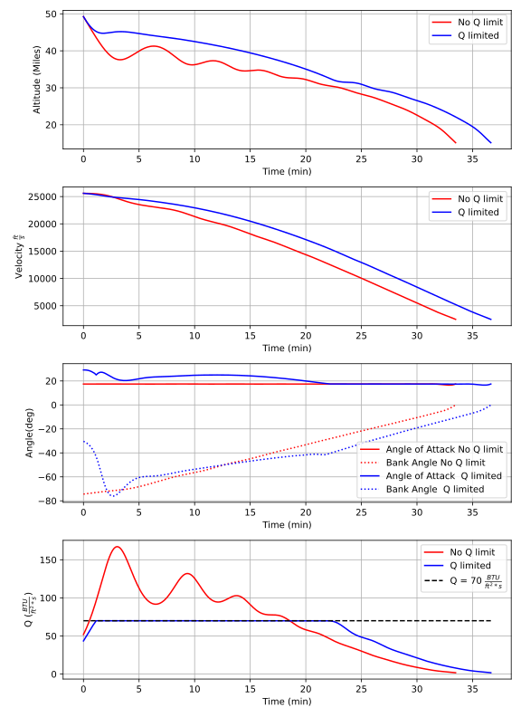

Space Shuttle Reentry
=====================

As a next example, we will solve another classic problem outlined by Betts in [1].

..  note:: 

    We should note that this example is derived entirely from publicly available sources (see [1-4]). Furthermore, this problem is routinely 
    used [1-4] as a benchmark for optimal control packages such as ASSET.

This problem involves maximizing the cross range
of the Space Shuttle during reentry. The dynamics are written in spherical coordinates and incorporate gravity and an empirical model for the lift and
drag characteristics of the shuttle. The state variables are the altitude, :math:`h`, latitude, :math:`\theta`, velocity, :math:`v`, flight path angle, :math:`\gamma`,
and azimuth, :math:`\psi`.
The controls are the angle of attack, :math:`\alpha`, and bank angle, :math:`\beta`, of the vehicle. 

.. math::

    \dot{h}      &= v \sin(\gamma)
    
    \dot{\theta} &= \frac{v}{r} \cos(\gamma) \cos(\psi)
    
    \dot{v}      &= -\frac{D}{m} - g \sin(\gamma) 
    
    \dot{\gamma} &=  \frac{L}{mv}\cos(\beta) + \cos(\gamma)\left( \frac{v}{r} - \frac{g}{v} \right)
    
    \dot{\psi}   &=  \frac{L}{mv \cos(\gamma)}\sin(\beta) +\frac{v}{r \cos(\theta)}\cos(\gamma)\sin(\psi)\sin(\theta)
    

.. math::

    D,L &= \frac{1}{2} C_{L,D} S \rho v^2

    g &= \frac{\mu}{r^2}

    r &= R_e + h

    \rho  &= \rho_0 e^{-h/h_0}

    C_L &= a_0 + a_1 \hat{\alpha} 

    C_D &= b_0 + b_1 \hat{\alpha} + b_2 \hat{\alpha}^2 

The initial and terminal values of the state variables for this problem are given below.

.. math::
    
    h(0)  &=260000\; ft \quad \quad v(0)  &= 25600 \; ft/sec   \quad \quad \gamma(0)&=-1 ^\circ  \quad \quad \theta(0)=0 ^\circ  \quad \quad  \phi(0)=0 ^\circ

    h(t_f)&=80000 \; ft \quad \quad v(t_f)&= 2500 \; ft/sec   \quad \quad \gamma(t_f)&=-5 ^\circ  

The objective is to maximize the cross range, which for this model and initial conditions is equivalent to maximizing :math:`\theta(t_f)`.

Similar to Betts, we examine the solution to this problem both with and without a path constraint on the wing leading edge heating rate, :math:`q`. 

.. math::
    
    q &=  q_r q_{\alpha} < 70 \frac{BTU}{ft^2 s}

    q_r &= 17700 \sqrt{\rho}(.0001 v)^{3.07}

    q_{\alpha} &= c_0 + c_1 \hat{\alpha} + c_2 \hat{\alpha}^2 + c_3 \hat{\alpha}^3

    

As we have mentioned previously, solving problems in standard units (Miles, Km, fps etc.) is typically very ill conditioned and degrades the performance
of an otherwise well posed problem. Therefore, as the first step to solving this problem, we will non-dimensionalize all variables and equations to be of order unity.
This is done by defining characteristic length, mass, and time units from which we can define other derived units through dimensional analysis. In this example we
select :code:`Lstar` to be 100,000 feet and :code:`tstar` to be 60 seconds. :code:`Mstar` is then set to be the mass of the shuttle. After constructing our derived units, we can simply divide our physical 
constants by the appropriate unit to get their non-dimensional value. 

.. code-block:: python

    ################### Non Dimensionalize ##################################
    g0 = 32.2 
    W  = 203000

    Lstar = 100000.0     ## feet
    Tstar = 60.0         ## sec
    Mstar = W/g0         ## slugs

    Vstar   = Lstar/Tstar
    Fstar   = Mstar*Lstar/(Tstar**2)
    Astar   = Lstar/(Tstar**2)
    Rhostar = Mstar/(Lstar**3)
    BTUstar = 778.0*Lstar*Fstar
    Mustar  = (Lstar**3)/(Tstar**2)

    tmax = 2500            /Tstar
    Re = 20902900          /Lstar
    S  = 2690.0            /(Lstar**2)
    m  = (W/g0)            /Mstar
    mu = (0.140765e17)     /Mustar
    rho0 =.002378          /Rhostar
    h_ref = 23800          /Lstar

    a0 = -.20704
    a1 = .029244

    b0 = .07854
    b1 = -.61592e-2
    b2 = .621408e-3

    c0 =  1.0672181
    c1 = -.19213774e-1
    c2 = .21286289e-3
    c3 = -.10117e-5

    Qlimit = 70.0

    ##############################################################################

Having non-dimensionalized our constants, we can now write the EOM's as an :code:`oc.ODEBase` object as we have done in previous examples. For this model, there are
five state variables :math:`(h,\theta,v,\gamma,\psi)` and two control variables :math:`(\alpha,\beta)`.

.. code-block:: python

    class ShuttleReentry(oc.ODEBase):
        def __init__(self):
        
            Xvars = 5
            Uvars = 2
        
            ############################################################
            XtU  = oc.ODEArguments(Xvars,Uvars)
        
        
            h,theta,v,gamma,psi = XtU.XVec().tolist()
        
            alpha,beta = XtU.UVec().tolist()
        
        
            alphadeg = (180.0/np.pi)*alpha
        
            CL  = a0 + a1*alphadeg
            CD  = b0 + b1*alphadeg + b2*(alphadeg**2)
            rho = rho0*vf.exp(-h/h_ref)
            r   = h + Re
        
            L   = 0.5*CL*S*rho*(v**2)
            D   = 0.5*CD*S*rho*(v**2)
            g   = mu/(r**2)
        
            sgam = vf.sin(gamma)
            cgam = vf.cos(gamma)
        
            sbet = vf.sin(beta)
            cbet = vf.cos(beta)
        
            spsi = vf.sin(psi)
            cpsi = vf.cos(psi)
            tantheta = vf.tan(theta)
        
            hdot     = v*sgam
            thetadot = (v/r)*cgam*cpsi
            vdot     = -D/m - g*sgam
            gammadot = (L/(m*v))*cbet +cgam*(v/r - g/v)
            psidot   = L*sbet/(m*v*cgam) + (v/(r))*cgam*spsi*tantheta
        
    
            ode = vf.stack([hdot,thetadot,vdot,gammadot,psidot])
            ##############################################################
            super().__init__(ode,Xvars,Uvars)

Additionally, we can express our heating rate constraint as an ASSET VectorFunction.

.. code-block:: python

    def QFunc():
        h,v,alpha = Args(3).tolist()
        alphadeg = (180.0/np.pi)*alpha
        rhodim = rho0*vf.exp(-h/h_ref)*Rhostar
        vdim = v*Vstar
    
        qr = 17700*vf.sqrt(rhodim)*((.0001*vdim)**3.07)
        qa = c0 + c1*alphadeg + c2*(alphadeg**2)+ c3*(alphadeg**3)
    
        return qa*qr

Next we must define a suitable initial guess for the optimization. Bett's problem definition places an upper limit of 2500 sec 
on this problem, but we assume an initial guess of :math:`t_f` = 1000 sec as is done in [2,3]. We are given initial and terminal values of the altitude, velocity, 
and :math:`\gamma`, so it is natural to construct the initial guess for these state variables as linear functions over the interval (:math:`0-t_f`).
:math:`\psi` and :math:`\theta` are only given initial values and we have no good physical intuition 
for how they will evolve so like [2,3] our initial guess assumes that they are constant. 
For both control angles, we just assume that they are 0.

.. code-block:: python

    tf  = 1000/Tstar

    ht0  = 260000/Lstar
    htf  = 80000 /Lstar
    vt0  = 25600/Vstar
    vtf  = 2500 /Vstar

    
    gammat0 = np.deg2rad(-1.0)
    gammatf = np.deg2rad(-5.0)
    psit0   = np.deg2rad(90.0)

    ts = np.linspace(0,tf,200)

    TrajIG = []
    for t in ts:
        X = np.zeros((8))
        X[0] = ht0*(1-t/tf) + htf*t/tf
        X[1] = 0
        X[2] = vt0*(1-t/tf) + vtf*t/tf
        X[3] = gammat0*(1-t/tf) + gammatf*t/tf
        X[4] = psit0
        X[5] = t
        X[6] =.00
        X[7] =.00
        TrajIG.append(np.copy(X))

With preliminaries completed we can now solve the problem. We first construct our :code:`ode` and :code:`phase` object, and use
40 LGL3 segments to discretize the problem. We then enforce our known initial conditions as a boundary value constraint. Next, we
apply the given bounds on our states and controls as path constraints and also place the specified upper bound on the final time. Last, we enforce the terminal conditions
on altitude, velocity, and flight path angle, and then specify that the objective is to minimize :math:`-\Delta \theta`. This is equivalent to maximizing :math:`\Delta \theta`.
Given our rather poor initial guess for this problem, PSIOPT is invoked in :code:`solve_optimize` mode, so that it first finds a feasible solution 
satisfying all constraints before minimizing the objective. Furthermore, we enable the line search as an extra safe-guard.

.. code-block:: python

    ode = ShuttleReentry()
    
    phase = ode.phase("LGL3",TrajIG,40)
    
    phase.addBoundaryValue("Front",range(0,6),TrajIG[0][0:6])
    phase.addLUVarBounds("Path",[1,3],np.deg2rad(-89.0),np.deg2rad(89.0),1.0)
    phase.addLUVarBound("Path",6,np.deg2rad(-90.0),np.deg2rad(90.0),1.0)
    phase.addLUVarBound("Path",7,np.deg2rad(-90.0),np.deg2rad(1.0) ,1.0)
    phase.addUpperDeltaTimeBound(tmax,1.0)
    phase.addBoundaryValue("Back" ,[0,2,3],[htf,vtf,gammatf])
    phase.addDeltaVarObjective(1,-1.0)
    phase.setThreads(8,8)
    
    ## Our IG is bad, so i turn on line search
    phase.optimizer.set_SoeLSMode("L1")
    phase.optimizer.set_OptLSMode("L1")
    phase.optimizer.set_PrintLevel(1)
    
    ## IG is bad, solve first before optimize
    phase.solve_optimize()

    #Refine to more segments and Reoptimize
    phase.refineTrajManual(300)
    phase.optimize()

    Traj1 = phase.returnTraj()
    
    ## Add in Heating Rate Constraint, scale so rhs is order 1
    phase.addUpperFuncBound("Path",QFunc(),[0,2,6],Qlimit,1/Qlimit)
    phase.optimize()
    
    Traj2 = phase.returnTraj()
    
    print("Final Time:",Traj1[-1][5]*Tstar,"(s) , Final Cross Range:",Traj1[-1][1]*180/np.pi, " deg")
    print("Final Time:",Traj2[-1][5]*Tstar,"(s) , Final Cross Range:",Traj2[-1][1]*180/np.pi, " deg")
   

    Plot(Traj1,Traj2)

For this problem, PSIOPT is able to find a feasible solution in 29 iterations of the :code:`solve` algorithm, and then an optimum solution after another 98 iterations
in the :code:`optimize` algorithm. We then refine the trajectory to a higher number of segments and re-optimize the solution, which converges in only 5 iterations. 
The total run-time (i9-12900k) is 90 milliseconds. The final objective value for :math:`\Delta \theta` is 34.141 degrees, which is exactly that given by Betts in [1]. 
Next we add the path constraint on leading edge heating rate to the phase and optimize the new problem using the previous solution as the initial guess. Owing to the excellent initial guess, the heat rate limited problem converges in
another 24 iterations taking only 60 milliseconds. The additional heating rate constraint reduces the maximum cross range of the shuttle to 30.63 degrees (also identical to Betts).
A plot of the converged state and control histories for both problem formulations can be seen below.

The complete code for this example is listed at the bottom of this page.

References
##########
#. Betts, J.T. "Practical methods for Optimal Control and Estimation Using Nonlinear Programming", Cambridge University Press, 2009
#. Agamawi, Y. M., & Rao, A. V. (2020). Cgpops: A c++ software for solving multiple-phase optimal control problems using adaptive gaussian quadrature collocation and sparse nonlinear programming. ACM Transactions on Mathematical Software (TOMS), 46(3), 1-38.
#. Patterson, M. A., & Rao, A. V. (2014). GPOPS-II: A MATLAB software for solving multiple-phase optimal control problems using hp-adaptive Gaussian quadrature collocation methods and sparse nonlinear programming. ACM Transactions on Mathematical Software (TOMS), 41(1), 1-37.
#. Falck, R. (2022). https://openmdao.github.io/dymos/examples/reentry/reentry.html.

Full Code
#########

.. code-block:: python
    
    import numpy as np
    import asset_asrl as ast
    import matplotlib.pyplot as plt

    vf        = ast.VectorFunctions
    oc        = ast.OptimalControl
    Args      = vf.Arguments

    '''
    Space Shuttle Reentry
    Betts, J.T. Practical methods for Optimal Control and Estimation Using Nonlinear Programming, Cambridge University Press, 2009
    '''

    ################### Non Dimensionalize ##################################
    g0 = 32.2 
    W  = 203000

    Lstar = 100000.0     ## feet
    Tstar = 60.0         ## sec
    Mstar = W/g0         ## slugs

    Vstar   = Lstar/Tstar
    Fstar   = Mstar*Lstar/(Tstar**2)
    Astar   = Lstar/(Tstar**2)
    Rhostar = Mstar/(Lstar**3)
    BTUstar = 778.0*Lstar*Fstar
    Mustar  = (Lstar**3)/(Tstar**2)

    tmax = 2500            /Tstar
    Re = 20902900          /Lstar
    S  = 2690.0            /(Lstar**2)
    m  = (W/g0)            /Mstar
    mu = (0.140765e17)     /Mustar
    rho0 =.002378          /Rhostar
    h_ref = 23800          /Lstar

    a0 = -.20704
    a1 = .029244

    b0 = .07854
    b1 = -.61592e-2
    b2 = .621408e-3

    c0 =  1.0672181
    c1 = -.19213774e-1
    c2 = .21286289e-3
    c3 = -.10117e-5

    Qlimit = 70.0

    ##############################################################################
    class ShuttleReentry(oc.ODEBase):
        def __init__(self):
        
            Xvars = 5
            Uvars = 2
        
            ############################################################
            XtU  = oc.ODEArguments(Xvars,Uvars)
        
        
            h,theta,v,gamma,psi = XtU.XVec().tolist()
        
            alpha,beta = XtU.UVec().tolist()
        
        
            alphadeg = (180.0/np.pi)*alpha
        
            CL  = a0 + a1*alphadeg
            CD  = b0 + b1*alphadeg + b2*(alphadeg**2)
            rho = rho0*vf.exp(-h/h_ref)
            r   = h + Re
        
            L   = 0.5*CL*S*rho*(v**2)
            D   = 0.5*CD*S*rho*(v**2)
            g   = mu/(r**2)
        
            sgam = vf.sin(gamma)
            cgam = vf.cos(gamma)
        
            sbet = vf.sin(beta)
            cbet = vf.cos(beta)
        
            spsi = vf.sin(psi)
            cpsi = vf.cos(psi)
            tantheta = vf.tan(theta)
        
            hdot     = v*sgam
            thetadot = (v/r)*cgam*cpsi
            vdot     = -D/m - g*sgam
            gammadot = (L/(m*v))*cbet +cgam*(v/r - g/v)
            psidot   = L*sbet/(m*v*cgam) + (v/(r))*cgam*spsi*tantheta
        
    
            ode = vf.stack([hdot,thetadot,vdot,gammadot,psidot])
            ##############################################################
            super().__init__(ode,Xvars,Uvars)

    def QFunc():
        h,v,alpha = Args(3).tolist()
        alphadeg = (180.0/np.pi)*alpha
        rhodim = rho0*vf.exp(-h/h_ref)*Rhostar
        vdim = v*Vstar
    
        qr = 17700*vf.sqrt(rhodim)*((.0001*vdim)**3.07)
        qa = c0 + c1*alphadeg + c2*(alphadeg**2)+ c3*(alphadeg**3)
    
        return qa*qr
 
    #############################################################################

    def Plot(Traj1,Traj2):
        TT1 = np.array(Traj1).T
        TT2 = np.array(Traj2).T

        fig, axs = plt.subplots(4,1)

        axs[0].plot(TT1[5]*Tstar/60.0,TT1[0]*Lstar/5280,label='No Q limit',color='r')
        axs[0].plot(TT2[5]*Tstar/60.0,TT2[0]*Lstar/5280,label='Q limited',color='b')
        axs[0].set_ylabel("Altitude (Miles)")

        axs[1].plot(TT1[5]*Tstar/60.0,TT1[2]*Vstar,label='No Q limit',color='r')
        axs[1].plot(TT2[5]*Tstar/60.0,TT2[2]*Vstar,label='Q limited',color='b')

        axs[1].set_ylabel(r"Velocity $\frac{ft}{s}$")

        axs[2].plot(TT1[5]*Tstar/60.0,np.rad2deg(TT1[6]),label='Angle of Attack No Q limit',color='r')
        axs[2].plot(TT1[5]*Tstar/60.0,np.rad2deg(TT1[7]),label='Bank Angle No Q limit',color='r',linestyle='dotted')
        axs[2].plot(TT2[5]*Tstar/60.0,np.rad2deg(TT2[6]),label='Angle of Attack  Q limited',color='b')
        axs[2].plot(TT2[5]*Tstar/60.0,np.rad2deg(TT2[7]),label='Bank Angle  Q limited',color='b',linestyle='dotted')

        axs[2].set_ylabel("Angle(deg)")

        qfunc = QFunc().eval(8,[0,2,6])

        qs1 = [qfunc(T)[0] for T in Traj1]
        qs2 = [qfunc(T)[0] for T in Traj2]

        axs[3].plot(TT1[5]*Tstar/60.0,qs1,label='No Q limit',color='r')
        axs[3].plot(TT2[5]*Tstar/60.0,qs2,label='Q limited',color='b')
        axs[3].set_ylabel(r"Q $(\frac{BTU}{ft^2 *s})$")

        axs[3].plot(TT2[5]*Tstar/60.0,np.ones_like(TT2[5])*70,label=r'Q = 70 $\frac{BTU}{ft^2 *s}$',color='k',linestyle='dashed')

        for i in range(0,4):
            axs[i].grid(True)
            axs[i].set_xlabel("Time (min)")
            axs[i].legend()

        fig.set_size_inches(8.0, 11.0, forward=True)
        fig.tight_layout()

        plt.show()
    

    if __name__ == "__main__":
        ##########################################################################
        tf  = 1000/Tstar

        ht0  = 260000/Lstar
        htf  = 80000 /Lstar
        vt0  = 25600/Vstar
        vtf  = 2500 /Vstar

    
        gammat0 = np.deg2rad(-1.0)
        gammatf = np.deg2rad(-5.0)
        psit0   = np.deg2rad(90.0)

        ts = np.linspace(0,tf,200)

        TrajIG = []
        for t in ts:
            X = np.zeros((8))
            X[0] = ht0*(1-t/tf) + htf*t/tf
            X[1] = 0
            X[2] = vt0*(1-t/tf) + vtf*t/tf
            X[3] = gammat0*(1-t/tf) + gammatf*t/tf
            X[4] = psit0
            X[5] = t
            X[6] =.00
            X[7] =.00
            TrajIG.append(np.copy(X))
        
        
        ################################################################

        ode = ShuttleReentry()
    
        phase = ode.phase("LGL3",TrajIG,40)
    
        phase.addBoundaryValue("Front",range(0,6),TrajIG[0][0:6])
        phase.addLUVarBounds("Path",[1,3],np.deg2rad(-89.0),np.deg2rad(89.0),1.0)
        phase.addLUVarBound("Path",6,np.deg2rad(-90.0),np.deg2rad(90.0),1.0)
        phase.addLUVarBound("Path",7,np.deg2rad(-90.0),np.deg2rad(1.0) ,1.0)
        phase.addUpperDeltaTimeBound(tmax,1.0)
        phase.addBoundaryValue("Back" ,[0,2,3],[htf,vtf,gammatf])
        phase.addDeltaVarObjective(1,-1.0)
        phase.setThreads(8,8)
    
        ## Our IG is bad, so i turn on line search
        phase.optimizer.set_SoeLSMode("L1")
        phase.optimizer.set_OptLSMode("L1")
        phase.optimizer.set_PrintLevel(1)
    
        ## IG is bad, solve first before optimize
        phase.solve_optimize()

        #Refine to more segments and Reoptimize
        phase.refineTrajManual(300)
        phase.optimize()

        Traj1 = phase.returnTraj()
    
        ## Add in Heating Rate Constraint, scale so rhs is order 1
        phase.addUpperFuncBound("Path",QFunc(),[0,2,6],Qlimit,1/Qlimit)
        phase.optimize()
    
        Traj2 = phase.returnTraj()
    
        print("Final Time:",Traj1[-1][5]*Tstar,"(s) , Final Cross Range:",Traj1[-1][1]*180/np.pi, " deg")
        print("Final Time:",Traj2[-1][5]*Tstar,"(s) , Final Cross Range:",Traj2[-1][1]*180/np.pi, " deg")
   

        Plot(Traj1,Traj2)

