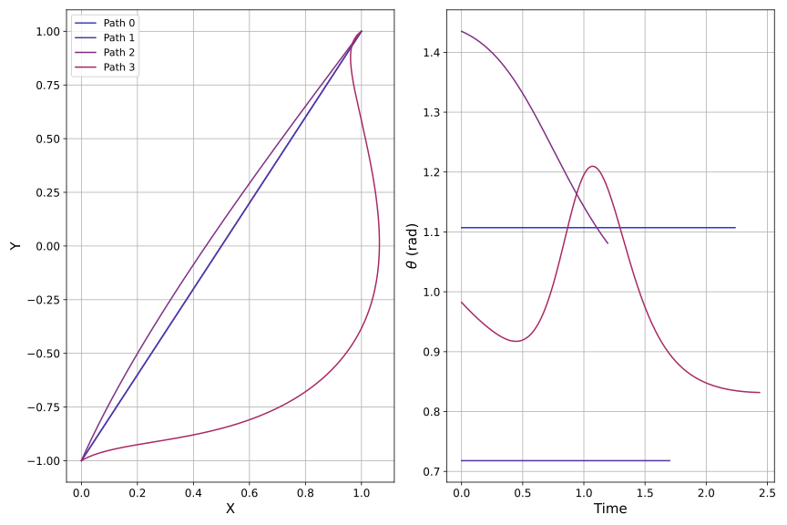
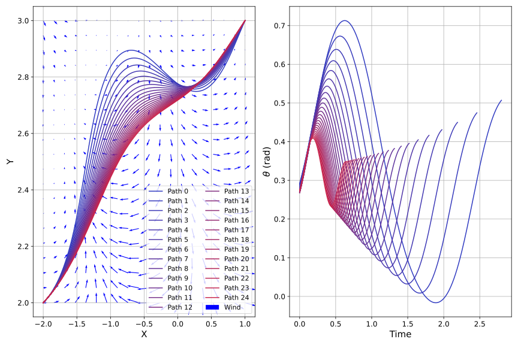

Zermelo's Problem
============================

Ernst Zermelo's question of optimal navigation is a classic in the field of optimal control.
In this tutorial, we will demonstrate how ASSET can be used to construct a modular solution approach that allows the user to easily manipulate the conditions of the problem.
These type of parameter estimation tasks were a core motivation during initial development, and although it requires some intermediate programming techniques, the return on investment is extremely compelling.
This tutorial will move a bit faster than the :ref:`Orbit Family Continuation` example, and focuses more on how to use ASSET rather than how ASSET works.
We'll also be finding trajectories that optimize an objective instead of just satisfying constraints.

As a quick overview, here's the problem that interested Zermelo:
    If you are in a boat with a constant speed and are subject to a wind that is a function of location and time, how should you steer your boat to get from point A to point B the fastest?

Problem Setup
-------------

You're probably familiar with the standard set of import packages.
Numpy and ASSET are required, and matplotlib is just my preferred graphing library.
We'll also go ahead and establish the standard shorthand conventions.

.. code-block:: python

    import asset_asrl as ast
    import numpy as np
    import matplotlib.pyplot as plt
    import matplotlib as mpl

    #Change a few of the matplotlib label sizes for ease of reading plots
    params = {'xtick.labelsize': 12, 'ytick.labelsize' : 12,
              'axes.labelsize':15, 'legend.fontsize':11}
    mpl.rcParams.update(params) 

    ################################################################################
    ## Setup
    oc = ast.OptimalControl
    vf = ast.VectorFunctions

    phaseRegs = oc.PhaseRegionFlags
    tModes = oc.TranscriptionModes

My personal organizational style is to put constants at the top of the file, and even though it's a bit logically out of line, most of the following items should be familiar to you.
:code:`nSeg` is the number of segments we will use in the collocation scheme later, and :code:`tol` is the convergence tolerance, which, in this case, we will apply to constraints and an objective.
There are also :code:`nVecPlot` and :code:`vecPlotScale`, which control plotting of a vector field.
Any of these parameters can be tuned to your preference.

.. code-block:: python

    ################################################################################
    ## Constants
    nSeg = 250
    tol = 1e-12
    nVecPlot = 20
    vecPlotScale = 0.1

Now we'll define the system dynamics.
It's just basic 2D motion with angular control of the velocity vector, except we don't yet know how the wind blows.
Fortunately, we can build our model so that it accepts a function that will define the wind patterns external to the model itself.
Look below.

.. code-block:: python

    ################################################################################
    ## System Dynamics
    class Zermelo(oc.ODEBase):
        def __init__(self, vMax, wFunc):
            Xvars = 2
            Uvars = 1
        
            #we use vf.Arguments as opposed to 
            #oc.ODEArguments because of the time dependent model
            args = vf.Arguments(Xvars + 1 + Uvars)
            xyt = args.head_3()
            th = args[3]

            wx, wy = wFunc(xyt)

            xD = vMax * vf.cos(th) + wx
            yD = vMax * vf.sin(th) + wy

            ode = vf.Stack([xD, yD])

            super().__init__(ode, Xvars, Uvars)

The constructor argument :code:`wFunc` is any function that returns the :math:`x` and :math:`y` components of wind when it's passed the current location and time, :code:`xyt`.
As long as :code:`wFunc` has the correct input and output signatures, and it operates on ASSET VectorFunctions, you can construct an instance of the :code:`Zermelo` ODE that captures those dynamics.
We also parameterize over boat speed :code:`vMax`, meaning an instantiation would look something like :code:`zerm_ode = Zermelo(4, myWindFunction)`.
Just to reiterate some ASSET formalisms, the input size of an ODE is *state variables* plus *time variable* plus *control variables* plus *parameter variables*.
Also, you **must** use :code:`vf.sin` instead of :code:`np.sin` since we are working with functions instead of values.

With that last reminder fresh in mind, let's move on to writing functions that define the wind.
In order to be used in the :code:`Zermelo` definition, these functions must operate on ASSET functions, not numerical values.
Here's a first example:

.. code-block:: python

    ################################################################################
    ## Wind Functions
    def noWind(xyt):
        return 0, 0

And here's another:

.. code-block:: python

    def uniformWind(xyt, ang=135 * np.pi / 180, vel=2):
        return vel * np.cos(ang), vel * np.sin(ang)

The astute among you will notice that despite my warnings, these functions don't refer to ASSET, and the second one actually uses NumPy!
We're permitted to do this because neither of these functions use the :code:`xyt` argument, bypassing the use of VectorFunctions and only dealing with constant numbers.
What's dangerous and disallowed is passing :code:`xyt` to numerical operations.
If you scroll back up to the definition of :code:`xD` and :code:`yD` in the system dynamics, you'll see that if :code:`wx` and :code:`wy` are numbers, the addition operation is well-defined.

Okay, no more trick functions.
Let's suppose that the direction of the wind is constant, but the magnitude changes with boat location.
Arbitrarily, say that wind speed is equal to the cosine of the boat's distance to the origin.
In the following code, keep a close eye on which terms are VectorFunctions and which are plain old numbers.

.. code-block:: python

    def constantDirWind(xyt, ang=45 * np.pi / 180):
        vel = vf.cos(xyt.head2().norm())

        return vel * np.cos(ang), vel * np.sin(ang)

The default angle is 45 degrees, and since :code:`ang` is a known number, we can use the numpy trig methods.
In order to have a full suite of test functions, let's define one that has varying direction as well:

.. code-block:: python

    def variableDirWind(xyt):
        vel = vf.sin(xyt.head2().norm())
        ang = 2 * (xyt[0] + xyt[1])

        return vel * vf.cos(ang), vel * vf.sin(ang)

Solver Function
---------------

Just like in the periodic orbit example, it's good practice to package up the solution code into its own function.
There are four arguments that define this problem: Where you start, where you finish, how fast you go, and the wind conditions.
Based on those inputs, we need to:

1. Generate an initial guess
2. Initialize the optimal control phase
3. Enforce the trajectory to start at A and end at B
4. Tell the optimizer to minimize time
5. Optimize

.. code-block:: python

    ################################################################################
    ## Solver function
    def navigate(A, B, vM=1, wF=uniformWind):
        # 1. Initial guess is straight line
        dist = np.linalg.norm(B - A)
        t0 = dist / vM
        d = (B - A) / dist
        ang = np.arctan2(d[1], d[0])
        trajG = [
            np.array(list(A + d * x) + [t0 * x, ang]) for x in np.linspace(0, 1, num=nSeg)
        ]

        # 2. Initialize phase
        phase = Zermelo(vM, wF).phase(tModes.LGL3)
        phase.Threads = 10  # Equal to number of physical cores

        phase.setTraj(trajG, nSeg)

        # 3. Enforce start and end points
        phase.addBoundaryValue("Front", [0, 1], A)
        phase.addBoundaryValue("Front", [2], [0.0])
        phase.addBoundaryValue("Back", [0, 1], B)

        phase.addLUVarBound("Path", 3, -np.pi, np.pi, 1)

        # 4. Add objective function
        phase.addDeltaTimeObjective(1.0)

        # 5. Optimize
        phase.optimizer.set_EContol(tol)
        phase.optimizer.set_KKTtol(tol)
        phase.solve_optimize()

        return phase.returnTraj()

In the last tutorial, our initial guess was numerically integrated from a state obtained from a reputable source.
This time, the problem is a bit simpler, so we'll set the initial guess to just be a straight line between the start and finish.
The rest of the setup follows standard ASSET idioms: add boundary values, set optimizer tolerances, etc.
Two new operations are :code:`addLUVarBound` and :code:`addDeltaTimeObjective`.
The first one is used to set a lower and upper bound on the control for the entire trajectory.
Since the control is an angle, it's reasonable to restrict it between :math:`\pm\pi`.
The :code:`addDeltaTimeObjective` makes this solver fundamentally different from the halo orbit code.
If our only task was to get from point A to point B, Zermelo's problem would hardly even be a problem.
What we actually want to know is the *best* path from A to B, measured by how long it takes.
Since time-optimal control is such a common question, it is built into ASSET directly.
The last item of note is that if we add an objective, we may want to set :code:`KKTtol`, which defines the satisfactory condition for optimality.

Running and Plotting
--------------------

Now for the good stuff.
The work we put in making things generic will allow us to quickly and concisely explore a large parameter space for this problem.
We'll start by comparing wind models.
I'm omitting the in-line definition of the plotting functions, but you can find them at the end of the page in the full source listing.

.. code-block:: python

    ################################################################################
    ## Compare Wind Models
    def compareWind():
        A = np.array([0, -1])
        B = np.array([1, 1])
        vM = 1.25

        test1 = navigate(A, B, vM=1, wF=noWind)
        test2 = navigate(
            A,
            B,
            vM=vM,
            wF=lambda xyt: uniformWind(xyt, vel=0.5),
        )
        test3 = navigate(
            A,
            B,
            vM=vM,
            wF=constantDirWind,
        )
        test4 = navigate(A, B, vM=vM, wF=variableDirWind)

        plot2DTrajList([test1, test2, test3, test4])

The starting and ending points are defined as 2-element numpy arrays, and boat speed :code:`vM` is arbitrarily set to 1.25.
Then we simply call :code:`navigate` with various wind functions and see what happens.
Since this isn't a technical paper, I'll save the analysis and just let you enjoy the plots.

We may also want to know for a given wind system, what happens if we change the boat speed.

.. code-block:: python

    ################################################################################
    ## Compare Boat Speed
    def compareSpeed():
        A = np.array([-2, 2])
        B = np.array([1, 3])

        vMRange = np.linspace(1.1, 5, num=25)
        trajs = []
        for vM in vMRange:
            trajs.append(navigate(A, B, vM=vM, wF=variableDirWind))

        vdwx, vdwy = variableDirWind(vf.Arguments(2))

        plot2DTrajListVF(
            trajs,
            lambda xyt: (vdwx.compute(xyt), vdwy.compute(xyt)),
        )

Note that in this code, there's a bit of a work-around to make the ASSET-syntax :code:`variableDirWind` behave like a numeric function.
That's just so we can plot it as a vector field below:

Again, this is not the place for technical analysis of results.
That's your job.
ASSET just tries to help.

Full Source Listing
-------------------

Exercise for the reader: Write a time-varying wind function that incentivizes the optimizer to delay the start time of the trajectory.
How would the phase boundary conditions need to change?

.. code-block:: python

    import asset_asrl as ast
    import numpy as np
    import matplotlib.pyplot as plt
    import matplotlib as mpl

    #Change a few of the matplotlib label sizes for ease of reading plots
    params = {'xtick.labelsize': 12, 'ytick.labelsize' : 12,
              'axes.labelsize':15, 'legend.fontsize':11}
    mpl.rcParams.update(params) 

    ################################################################################
    ## Setup
    oc = ast.OptimalControl
    vf = ast.VectorFunctions

    phaseRegs = oc.PhaseRegionFlags
    tModes = oc.TranscriptionModes

    ################################################################################
    ## Constants
    nSeg = 250
    tol = 1e-12
    nVecPlot = 20
    vecPlotScale = 0.1

    ################################################################################
    ## System Dynamics
    class Zermelo(oc.ODEBase):
        def __init__(self, vMax, wFunc):
            Xvars = 2
            Uvars = 1
        
            #we use vf.Arguments as opposed to 
            #oc.ODEArguments because of the time dependent model
            args = vf.Arguments(Xvars + 1 + Uvars)
            xyt = args.head_3()
            th = args[3]

            wx, wy = wFunc(xyt)

            xD = vMax * vf.cos(th) + wx
            yD = vMax * vf.sin(th) + wy

            ode = vf.Stack([xD, yD])

            super().__init__(ode, Xvars, Uvars)

    ################################################################################
    ## Wind Functions
    def noWind(xyt):
        # No asset functions, just numbers
        return 0, 0

    # -------------------------------------

    def uniformWind(xyt, ang=135 * np.pi / 180, vel=2):
        # No asset functions, just numbers
        return vel * np.cos(ang), vel * np.sin(ang)

    # -------------------------------------

    def constantDirWind(xyt, ang=45 * np.pi / 180):
        vel = vf.cos(xyt.head2().norm())

        return vel * np.cos(ang), vel * np.sin(ang)

    # -------------------------------------

    def variableDirWind(xyt):
        vel = vf.sin(xyt.head2().norm())
        ang = 2 * (xyt[0] + xyt[1])

        return vel * vf.cos(ang), vel * vf.sin(ang)

    ################################################################################
    ## Solver function
    def navigate(A, B, vM=1, wF=uniformWind):
        # 1. Initial guess is straight line
        dist = np.linalg.norm(B - A)
        t0 = dist / vM
        d = (B - A) / dist
        ang = np.arctan2(d[1], d[0])
        trajG = [
            np.array(list(A + d * x) + [t0 * x, ang]) for x in np.linspace(0, 1, num=nSeg)
        ]

        # 2. Initialize phase
        phase = Zermelo(vM, wF).phase(tModes.LGL3)
        phase.Threads = 10  # Equal to number of physical cores

        phase.setTraj(trajG, nSeg)

        # 3. Enforce start and end points
        phase.addBoundaryValue("Front", [0, 1], A)
        phase.addBoundaryValue("Front", [2], [0.0])
        phase.addBoundaryValue("Back", [0, 1], B)

        phase.addLUVarBound("Path", 3, -np.pi, np.pi, 1)

        # 4. Add objective function
        phase.addDeltaTimeObjective(1.0)

        # 5. Optimize
        phase.optimizer.set_EContol(tol)
        phase.optimizer.set_KKTtol(tol)
        phase.solve_optimize()

        return phase.returnTraj()

    ################################################################################
    ## 2D Plotting
    def colorScale(x, left=[48, 59, 194], right=[208, 35, 70]):
        return [int(round((x * right[i]) + ((1 - x) * left[i])))/(256) for i in range(3)]

    def plot2DTrajList(tList):
    
        fig, axes = plt.subplots(1, 2, figsize = (12, 8))
        for i, t in enumerate(tList):
            clr = colorScale(i / len(tList))
            axes[0].plot([X[0] for X in t], [X[1] for X in t],
                         color = [(clr[0]), (clr[1]), (clr[2])],
                         label = "Path "+str(i))
        
            axes[1].plot([X[2] for X in t], [X[3] for X in t],
                         color = [(clr[0]), (clr[1]), (clr[2])])
        axes[0].grid(True)
        axes[0].set_xlabel("X")
        axes[0].set_ylabel("Y")
    
        axes[1].grid(True)
        axes[1].set_xlabel("Time")
        axes[1].set_ylabel("$\\theta$ (rad)")
        axes[0].legend()
        plt.tight_layout()
        plt.savefig("Plots/Zermelo/CompareWindModels.svg",
                    dpi = 500)
        plt.show()

    # -------------------------------------

    def plot2DTrajListVF(tList, wFunc_num):
        #fig = make_subplots(rows=1, cols=2)
    
        fig, axes = plt.subplots(1, 2, figsize = (12, 8))

        # Generate vector field for trajectory plot
        maxX = max([max([x[0] for x in t]) for t in tList])
        minX = min([min([x[0] for x in t]) for t in tList])
        maxY = max([max([x[1] for x in t]) for t in tList])
        minY = min([min([x[1] for x in t]) for t in tList])

        xRange = np.linspace(minX, maxX, num=nVecPlot)
        yRange = np.linspace(minY, maxY, num=nVecPlot)

        xPlot, yPlot = np.meshgrid(xRange, yRange)

        uPlot = np.zeros_like(xPlot)
        vPlot = np.zeros_like(xPlot)
        for i in range(nVecPlot):
            for j in range(nVecPlot):
                u_ij, v_ij = wFunc_num([xPlot[i, j], yPlot[i, j]])
                uPlot[i, j] = u_ij
                vPlot[i, j] = v_ij
            
        QV = axes[0].quiver(xPlot, yPlot, uPlot, vPlot, label = "Wind", color = "blue")
    

        # Overlay trajectories and control
        for i, t in enumerate(tList):
            clr = colorScale(i / len(tList))
            axes[0].plot([X[0] for X in t], [X[1] for X in t],
                         color = [(clr[0]), (clr[1]), (clr[2])],
                         label = "Path "+str(i))
        
            axes[1].plot([X[2] for X in t], [X[3] for X in t],
                         color = [(clr[0]), (clr[1]), (clr[2])])
        
        axes[0].grid(True)
        axes[0].set_xlabel("X")
        axes[0].set_ylabel("Y")
    
        axes[1].grid(True)
        axes[1].set_xlabel("Time")
        axes[1].set_ylabel("$\\theta$ (rad)")
        axes[0].legend(ncol =2)
        plt.tight_layout()
        plt.savefig("Plots/Zermelo/CompareBoatSpeed.svg",
                    dpi = 500)
        plt.show()

    ################################################################################
    ## Compare Wind Models
    def compareWind():
        A = np.array([0, -1])
        B = np.array([1, 1])
        vM = 1.25

        test1 = navigate(A, B, vM=1, wF=noWind)
        test2 = navigate(
            A,
            B,
            vM=vM,
            wF=lambda xyt: uniformWind(xyt, vel=0.5),
        )
        test3 = navigate(
            A,
            B,
            vM=vM,
            wF=constantDirWind,
        )
        test4 = navigate(A, B, vM=vM, wF=variableDirWind)

        plot2DTrajList([test1, test2, test3, test4])

    ################################################################################
    ## Compare Boat Speed
    def compareSpeed():
        A = np.array([-2, 2])
        B = np.array([1, 3])

        vMRange = np.linspace(1.1, 5, num=25)
        trajs = []
        for vM in vMRange:
            trajs.append(navigate(A, B, vM=vM, wF=variableDirWind))

        vdwx, vdwy = variableDirWind(vf.Arguments(2))

        plot2DTrajListVF(
            trajs,
            lambda xyt: (vdwx.compute(xyt), vdwy.compute(xyt)),
        )

    ################################################################################
    ## Main
    def main():
        compareWind()
        compareSpeed()

    ################################################################################
    ## Run
    if __name__ == "__main__":
        main()
