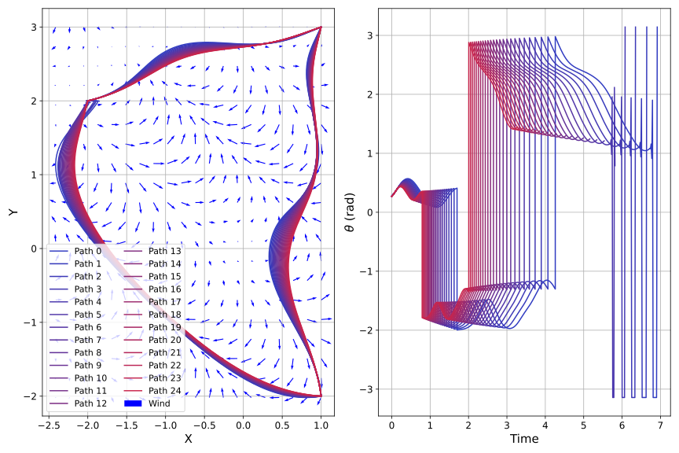

Multi-Phase Zermelo's Problem
==============================

If you haven't explored :ref:`Zermelo's Problem`, it is highly recommended that you do so before going much further.
It provides much needed background information about the problem, as well as the initial code that we will be modifying.

The previous example showed Zermelo's problem as a single phase problem. We were only trying to get from point A to B, with some constraints and objectives along
that single phase. What if instead we wanted travel from A to any arbitrary number of points along the way to our final destination? ASSET is designed to handle exactly this type of problem,
where each phase can have varying constraints and objectives to solve in the pursuit of our final target. In this example, we will expand the single phase Zermelo's problem into multiple phases, which is a very
useful tool to have for trajectory optimization.

Link Constraints:
#################

Link Constraints are the way that ASSET handles multi-phase problems. A link constraint enforces that state variables must be equal across phases. That is to say that the final state of phase 1 must be equal to the first state of phase 2.
To do this to the previous problem, we only have to make a few additions to the code from :ref:`Zermelo's Problem`. The primary changes occur in the :code:`navigate` function.

.. code-block:: python

    def navigate(Points, vM=1, wF=uniformWind):
        # Each phase between two points, therefore
        # the number of phases is the number of points - 1
        numphase = len(Points) - 1
        # 1. Initial guesses for phases by creating a straigh line from each point to the next
        trajG = []

        for i in range(0, numphase):
            A = Points[i]
            B = Points[i + 1]
            dist = np.linalg.norm(B - A)
            t0 = dist / vM
            d = (B - A) / dist
            ang = np.arctan2(d[1], d[0])
            trajG.append(
                [
                    np.array(list(A + d * x) + [t0 * x, ang])
                    for x in np.linspace(0, 1, num=nSeg)
                ]
            )

        ocp = oc.OptimalControlProblem()

Here we will discuss the changes to the :code:`navigate` function that allows us to turn this into a multi-phase problem. We will do this in sections of code to highlight specific changes, with the full, new function after.
The first change made is to have :code:`navigate` accept a list of points, :code:`Points` rather than just 2 points A and B. We also need to know how many phases this problem is to be broken into.
For this example, we will define each phase to be between each consecutive point. So, phase 1 is between Points A and B, and phase 2 is between points B and C, and so on. We make some minor changes to our
initial guess generating code to accompany this design choice. Lastly, we are going to need to bring in the :code:`OptimalControlProblem` interface as :code:`ocp`.

Now that we have our guess generator fixed to handle arbitrary size inputs we need to define each phase, as well as change constraints on each phase.

.. code-block:: python

    # 2. Initialize phases for each
        for i in range(0, numphase):
            A = Points[i]
            B = Points[i + 1]
            phase = Zermelo(vM, wF).phase(tModes.LGL3)

            phase.Threads = 8  # Equal to number of physical cores

            phase.setTraj(trajG[i], nSeg)

            # 3. Enforce start and end point
            if i == 0:
                phase.addBoundaryValue("Front", [0, 1], A)
                phase.addBoundaryValue("Front", [2], [0.0])
                phase.addBoundaryValue("Back", [0, 1], B)
            else:
                phase.addBoundaryValue("Back", [0, 1], B)

            phase.addLUVarBound("Path", 3, -np.pi, np.pi, 1)

            # 4. Add objective function
            phase.addDeltaTimeObjective(1.0)
            phase.addLowerDeltaTimeBound(0)

            # 5. Optimize
            phase.optimizer.set_EContol(tol)
            phase.optimizer.set_KKTtol(tol)

            # 6. add each phase to the optimal control problem
            ocp.addPhase(phase)

Since we have decided how we will define our phases, we need to iterate over the entire input :code:`Points` vector and assign the correct points to each phase. Notice that :code:`phase.setTraj(trajG[i], nSeg)` sets
an instance of :code:`trajG` for the current :code:`for` loop increment, since we have a different initial guess for each phase. The real meat of the changes in this section occur with redefining our constraints for the phase.
Previously we only had a single phase, so we simply needed to use :code:`phase.addBoundaryValue()` for the front and back of the phase. With a multi-phase problem, the way we set our constraints at the intersection of each phase
has to be carefully considered. Since our link constraint will ensure that the last state of a phase must match the first state of the next, we only need to fix the state at the initial starting point.
So we move our :code:`phase.addBoundaryValue()` constraints inside an :code:`if` block that only applies those constraints to the very first phase. However, for every other phase we also need to consider that the link constraint
is only going to fix the initial state of the phase. We will also need a constraint on the back of the phase ensuring that we get to the next point in our :code:`Points` vector.
We can achieve this by just applying a single :code:`phase.addBoundaryValue(phaseRegs.Back, [0, 1], B)` to every other phase, which says that our first 2 state variables must match point B of the current phase at the end point of the phase.
The :code:`phase.addDeltaTimeObjective(1.0)` stays the same, ensuring that time is minimized along each phase. **Note:** Something to consider in multi-phase problems is that the optimizer and solver will see nothing wrong
with having a negative time in the solution. Physically this doesn't make any sense, but it is perfectlly acceptable mathematically. To avoid this we define a :code:`phase.addLowerDeltaTimeBound(0)` on each phase, which ensures that the time difference between each
phase is at least 0 and never negative. Wrapping the phase construction up we use :code:`ocp.addPhase(phase)` to add each new phase to the overall optimal control problem.

The last step is to construct the link constraint and optimize the problem.

.. code-block:: python

    # Add a link constraint from the first phase to the last phase
        # This enforces that at the point between the phases the positions and time must be the
        # same as we assign it to state variables 0 and 1, and 2.
        ocp.addForwardLinkEqualCon(0, -1, [0, 1, 2])

        ocp.solve_optimize()

        out = []
        for ph in ocp.Phases:
            out += ph.returnTraj()

        return out

Using the optimal control problem interface from :code:`ocp`, we add a :code:`ocp.addForwardLinkEqualCon(0, -1, [0, 1, 2])` constraint, which states that from phase 0 to the last phase (indicated by passing a -1 to the call),
the back state of the previous phase and the front state of the next phase must satisfy that the state variables indicated in brackets (0, 1, and 2 which are x position, y position, and time) must be equal. This ensures continuity
between the phases and that our trajectory will be continuous. Aftwards we use the :code:`ocp.solve_optimize()` call to evaluate the problem. Then we package our phases into a singular trajectory to make plotting easier.

The final problem looks quite different from the single phase Zermelo problem, as we now move from point to point, all the while satisfying our optimization objectives and constraints for each phase.
We defined the initial points such that the boat maneuvers back to the initial state at the end time. However, any number of points could be added, provided that a feasible solution exists.

As for plots, first we have the comparison of the different wind models and how they affect the movement of the boat. We will take the same approach as last time and leave the technical analysis to you.

.. figure:: _static/CompareWindModelsLink.svg
    :width: 100%
    :align: center

The same as last time, we have also a plot to compare how different boat speeds affect the final trajectory in a multi-phase problem.

Full Code
#########

.. code-block:: python

    import asset as ast
    import numpy as np
    import asset_asrl as ast
    import numpy as np
    import matplotlib.pyplot as plt
    import matplotlib as mpl

    #Change a few of the matplotlib label sizes for ease of reading plots
    params = {'xtick.labelsize': 12, 'ytick.labelsize' : 12,
              'axes.labelsize':15, 'legend.fontsize':11}
    mpl.rcParams.update(params) 
    ################################################################################
    ## Setup
    oc = ast.OptimalControl
    vf = ast.VectorFunctions

    phaseRegs = oc.PhaseRegionFlags
    tModes = oc.TranscriptionModes

    ################################################################################
    ## Constants
    nSeg = 150
    tol = 1e-12
    nVecPlot = 20
    vecPlotScale = 0.1

    ################################################################################
    ## System Dynamics
    class Zermelo(oc.ODEBase):
        def __init__(self, vMax, wFunc):
            Xvars = 2
            Uvars = 1
        
            #we use vf.Arguments as opposed to 
            #oc.ODEArguments because of the time dependent model
            args = vf.Arguments(Xvars + 1 + Uvars)
            xyt = args.head_3()
            th = args[3]

            wx, wy = wFunc(xyt)

            xD = vMax * vf.cos(th) + wx
            yD = vMax * vf.sin(th) + wy

            ode = vf.Stack([xD, yD])

            super().__init__(ode, Xvars, Uvars)

    ################################################################################
    ## Wind Functions
    def noWind(xyt):
        # No asset functions, just numbers
        return 0, 0

    # -------------------------------------

    def uniformWind(xyt, ang=135 * np.pi / 180, vel=2):
        # No asset functions, just numbers
        return vel * np.cos(ang), vel * np.sin(ang)

    # -------------------------------------

    def constantDirWind(xyt, ang=45 * np.pi / 180):
        vel = vf.cos(xyt.head2().norm())

        return vel * np.cos(ang), vel * np.sin(ang)

    # -------------------------------------

    def variableDirWind(xyt):
        vel = vf.sin(xyt.head2().norm())
        ang = 2 * (xyt[0] + xyt[1])

        return vel * vf.cos(ang), vel * vf.sin(ang)

    ################################################################################
    ## Solver function
    def navigate(Points, vM=1, wF=uniformWind):
        # Each phase between two points, therefore
        # the number of phases is the number of points - 1
        numphase = len(Points) - 1
        # 1. Initial guesses for phases by creating a straigh line from each point to the next
        trajG = []

        for i in range(0, numphase):
            A = Points[i]
            B = Points[i + 1]
            dist = np.linalg.norm(B - A)
            t0 = dist / vM
            d = (B - A) / dist
            ang = np.arctan2(d[1], d[0])
            trajG.append(
                [
                    np.array(list(A + d * x) + [t0 * x, ang])
                    for x in np.linspace(0, 1, num=nSeg)
                ]
            )

        ocp = oc.OptimalControlProblem()

        # 2. Initialize phases for each
        for i in range(0, numphase):
            A = Points[i]
            B = Points[i + 1]
            phase = Zermelo(vM, wF).phase(tModes.LGL3)

            phase.Threads = 8  # Equal to number of physical cores

            phase.setTraj(trajG[i], nSeg)

            # 3. Enforce start and end point
            if i == 0:
                phase.addBoundaryValue("Front", [0, 1], A)
                phase.addBoundaryValue("Front", [2], [0.0])
                phase.addBoundaryValue("Back", [0, 1], B)
            else:
                phase.addBoundaryValue("Back", [0, 1], B)

            phase.addLUVarBound("Path", 3, -np.pi, np.pi, 1)

            # 4. Add objective function
            phase.addDeltaTimeObjective(1.0)
            phase.addLowerDeltaTimeBound(0)

            # 5. Optimize
            phase.optimizer.set_EContol(tol)
            phase.optimizer.set_KKTtol(tol)

            # 6. add each phase to the optimal control problem
            ocp.addPhase(phase)

        # Add a link constraint from the first phase to the last phase
        # This enforces that at the point between the phases the positions and time must be the
        # same as we assign it to state variables 0 and 1, and 2.
        ocp.addForwardLinkEqualCon(0, -1, [0, 1, 2])

        ocp.solve_optimize()

        out = []
        for ph in ocp.Phases:
            out += ph.returnTraj()

        return out

    ################################################################################
    ## 2D Plotting
    def colorScale(x, left=[48, 59, 194], right=[208, 35, 70]):
        return [int(round((x * right[i]) + ((1 - x) * left[i])))/(256) for i in range(3)]

    def plot2DTrajList(tList):
        fig, axes = plt.subplots(1, 2, figsize = (12, 8))
        for i, t in enumerate(tList):
            clr = colorScale(i / len(tList))
            axes[0].plot([X[0] for X in t], [X[1] for X in t],
                         color = [(clr[0]), (clr[1]), (clr[2])],
                         label = "Path "+str(i))
        
            axes[1].plot([X[2] for X in t], [X[3] for X in t],
                         color = [(clr[0]), (clr[1]), (clr[2])])
        axes[0].grid(True)
        axes[0].set_xlabel("X")
        axes[0].set_ylabel("Y")
    
        axes[1].grid(True)
        axes[1].set_xlabel("Time")
        axes[1].set_ylabel("$\\theta$ (rad)")
        axes[0].legend()
        plt.tight_layout()
        plt.savefig("Plots/Zermelo/CompareWindModelsLink.svg",
                    dpi = 500)
        plt.show()

    # -------------------------------------

    def plot2DTrajListVF(tList, wFunc_num):
        fig, axes = plt.subplots(1, 2, figsize = (12, 8))

        # Generate vector field for trajectory plot
        maxX = max([max([x[0] for x in t]) for t in tList])
        minX = min([min([x[0] for x in t]) for t in tList])
        maxY = max([max([x[1] for x in t]) for t in tList])
        minY = min([min([x[1] for x in t]) for t in tList])

        xRange = np.linspace(minX, maxX, num=nVecPlot)
        yRange = np.linspace(minY, maxY, num=nVecPlot)

        xPlot, yPlot = np.meshgrid(xRange, yRange)

        uPlot = np.zeros_like(xPlot)
        vPlot = np.zeros_like(xPlot)
        for i in range(nVecPlot):
            for j in range(nVecPlot):
                u_ij, v_ij = wFunc_num([xPlot[i, j], yPlot[i, j]])
                uPlot[i, j] = u_ij
                vPlot[i, j] = v_ij
            
        QV = axes[0].quiver(xPlot, yPlot, uPlot, vPlot, label = "Wind", color = "blue")
    

        # Overlay trajectories and control
        for i, t in enumerate(tList):
            clr = colorScale(i / len(tList))
            axes[0].plot([X[0] for X in t], [X[1] for X in t],
                         color = [(clr[0]), (clr[1]), (clr[2])],
                         label = "Path "+str(i))
        
            axes[1].plot([X[2] for X in t], [X[3] for X in t],
                         color = [(clr[0]), (clr[1]), (clr[2])])
        
        axes[0].grid(True)
        axes[0].set_xlabel("X")
        axes[0].set_ylabel("Y")
    
        axes[1].grid(True)
        axes[1].set_xlabel("Time")
        axes[1].set_ylabel("$\\theta$ (rad)")
        axes[0].legend(ncol =2)
        plt.tight_layout()
        plt.savefig("Plots/Zermelo/CompareBoatSpeedLink.svg",
                    dpi = 500)
        plt.show()

    ################################################################################
    ## Compare Wind Models
    def compareWind():
        A = np.array([0, -1])
        B = np.array([1, 1])
        C = np.array([4, 0])
        D = A
        vM = 1.5

        test1 = navigate([A, B, C, D], vM=1, wF=noWind)
        test2 = navigate(
            [A, B, C, D],
            vM=vM,
            wF=lambda xyt: uniformWind(xyt, vel=0.5),
        )
        test3 = navigate(
            [A, B, C, D],
            vM=vM,
            wF=constantDirWind,
        )
        test4 = navigate([A, B, C, D], vM=vM, wF=variableDirWind)

        plot2DTrajList(
            [
                test1,
                test2,
                test3,
                test4,
            ],
        )

    ################################################################################
    ## Compare Boat Speed
    def compareSpeed():
        A = np.array([-2, 2])
        B = np.array([1, 3])
        C = np.array([1, -2])
        D = A

        vMRange = np.linspace(1.85, 4., num=25)
        trajs = []
        for vM in vMRange:
            trajs.append(navigate([A, B, C, D], vM=vM, wF=variableDirWind))

        vdwx, vdwy = variableDirWind(vf.Arguments(2))

        plot2DTrajListVF(
            trajs,
            lambda xyt: (vdwx.compute(xyt), vdwy.compute(xyt)),
        )

    ################################################################################
    ## Main
    def main():
        compareWind()
        compareSpeed()

    ################################################################################
    ## Run
    if __name__ == "__main__":
        main()
