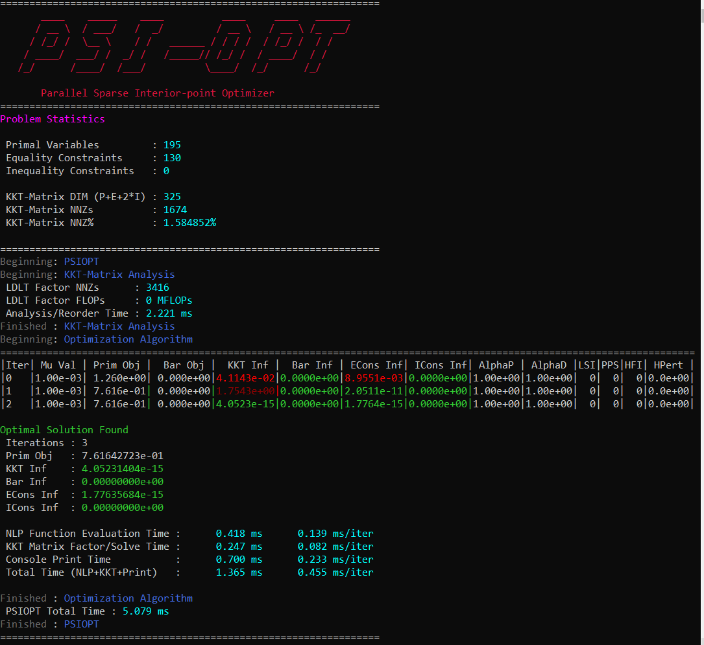

PSIOPT
======

An efficient method of solving sparse non-linear optimization problems is critical to the success of any trajectory optimization software. 
While several excellent optimization software packages exist, they all require either commercial products (KNITRO, SNOPT) or are reliant
on other commercial and restrictively licensed products for optimum performance (IPOPT).
Therefore, in order to keep ASSET completely open source, the Parallel Sparse Interior-point Optimizer (PSIOPT) was developed and incorporated into the library.
PSIOPT is built to solve non-linear programs (NLP) expressed in standard form as shown in Equation 1. 

.. math::
    
   min:f(\vec{x})

   \vec{h}(\vec{x})=\vec{0}

   \vec{g}(\vec{x})<\vec{0}{}

In short, it seeks to minimize a scalar valued objective function :math:`f(\vec{x})` of design variables, :math:`\vec{x}`, subject to equality, :math:`\vec{h}(\vec{x})`,
and an inequality, :math:`\vec{g}(\vec{x})`, constraints on those variables. PSIOPT adopts a primal-dual-interior-point approach to convert the problem into 
an equivalent bound constrained saddle-point optimization problem of the Lagrangian function defined in Equation 2. 

.. math::
    
   L(\vec{x},\vec{s},\vec{\nu},\vec{\lambda}) = f(\vec{x}) - \mu \sum \ln (s_i) + \vec{h}(\vec{x})\cdot\vec{\nu} + (\vec{g}(\vec{x}) + \vec{s})\cdot\vec{\lambda}

   \vec{s}>\vec{0}\quad\quad\quad\quad \vec{\lambda}>\vec{0}\quad\quad\quad\quad \mu>0\quad\quad\quad\quad

Additional non-negative slack variables, :math:`\vec{s}`, are added to each inequality constraint to capture the distance from the constraint boundary. 
An additional term, the barrier objective, is then added that penalizes solutions near the edge of the feasible region by taking the negative log of each slack variable.
The barrier objective is modulated by the single barrier term, :math:`\mu`, which is adaptively reduced throughout the optimization process to allow for active inequality constraints 
to approach the boundary of the feasible region. In addition, Lagrange multipliers are added for the equality, :math:`\vec{\nu}`, and inequality, :math:`\vec{\lambda}` constraints and 
appended to the Lagrangian. The solver then seeks stationary points of the Lagrangian function using a full-space Newton method. The iteration matrix can be seen in Equation 3 below.

.. math::
    
   \begin{bmatrix}
   \nabla_{_{xx}}L & 0 & \nabla_x h  & \nabla_x g  \\ 
   0 & \frac{\lambda}{s} & 0 & I\\ 
   \nabla_x h^T & 0 & 0 & 0\\ 
   \nabla_x g^T & I & 0 & 0
   \end{bmatrix}
   \begin{bmatrix}
   dx\\ds\\d\nu\\d\lambda
   \end{bmatrix}=-
   \begin{bmatrix}
   \nabla_x f + \nabla_x h \cdot \nu + \nabla_x g \cdot \lambda\\
   \lambda -\frac{\mu}{s}\\
   h\\
   g+s
   \end{bmatrix}

The first and second derivatives of the objectives and constraints appearing in Equation 3 are calculated analytically by ASSET's vector function type system.
Since computation of first and second derivatives is a computationally expensive task, the solver automatically detects independent functions and evaluate them in parallel on multi-core CPUs. 
To solve the resulting linear-system, the software leverages the state of the art sparse-symmetric-indefinite solver MKL PARDISO.

PSIOPT Output
-------------

.. list-table:: PSIOPT Print Output
   :width: 100%
   :widths: 10 90
   :header-rows: 1

   * - Parameter
     - Description
   * - Mu Val
     - Value of the barrier parameter, :math:`\mu` , at the current iterate .
   * - Prim Obj
     - Value of the primal objective, :math:`f(\vec{x})` , at the current iterate .
   * - Barr Obj
     - Value of the barrier objective, :math:`- \mu \sum \ln (s_i)` , at the current iterate .
   * - KKT Inf
     - Value of the optimality(KKT) infeasibility, :math:`| \nabla_x f + \nabla_x h \cdot \nu + \nabla_x g \cdot \lambda |_{\infty}` , at the current iterate .
   * - Barr Inf
     - Value of the barrier infeasibilty, :math:`|\vec{s}\otimes\vec{\lambda}|_{\infty}` , at the current iterate.
   * - ECons Inf
     - Value of the equality constraint infeasibilty, :math:`|\vec{h}(\vec{x})|_{\infty}` , at the current iterate.
   * - ICons Inf
     - Value of the inequality constraint infeasibilty, :math:`|\vec{g}(\vec{x}) + \vec{s}|_{\infty}` , at the current iterate.
   * - Max Emult
     - Value of maximum equality constraint multiplier, :math:`|\vec{\nu}|_{\infty}` , at the current iterate.
   * - Max Imult
     - Value of maximum inequality constraint multiplier, :math:`|\vec{\lambda}|_{\infty}` , at the current iterate.
   * - AlphaP
     - Step length of the primal and slack varibiales as determined by non-negativity constraints on s.
   * - AlphaD
     - Step length of the equality and inequality dual varibiales as determined by non-negativity constraints on lmbda.
   * - AlphaT
     - Total step length as determined by linesearch algorithm.
   * - Merit Val
     - Final value of the active linesaerchs merit function.
   * - LSI
     - Number of Line search iterations.
   * - PPS
     - Number of perturbed pivots seen during factorization of the KKT matrix.
   * - HFI
     - Number of hessian factorzation and regularization iterations needed to correct the inertia of the KKT matrix.
   * - HPert
     - Final value of the hessian perturbation that resulted in a successful matrix factorization.

.. list-table:: PSIOPT OPTIONS 
   :width: 100%
   :widths: 20 60 20 20
   :header-rows: 1

   * - Parameter
     - Description/Tips
     - Default Value
     - Valid/[Suggested] Range
   * - MaxIters
     - Maximum number of iterations the solve or optimization routines will run before returning with NO SOLUTION FOUND
     - (int) 300 
     - >0
   * - MaxAccIters
     - Maximum number of consecuative acceptable iterations the solve or optimization routines will run before returning with ACCEPTABLE SOLUTION FOUND. 
       An acceptable iterate is defined as having EconsInf,IConsInf,KKTinf, and all being less than their pecified acceptable value (Acc###tol). To disable
       acceptable solutions set this to be greater than or equal to MaxIters.
     - (int) 50 
     - >0
   * - MaxLSIters
     - Maximum number iterations for a line search algorithm will take before accepting the step. 
     - (int) 2 
     - >0 
       [1,3]
   * - alphaRed
     - Amount by which a linesearch algorithm divides the current stepsize when it fails to reduce the merit function. 
     - (double) 2.0 
     - >1.0 [1.5,3.0]
   * - OptLSMode
     - LineSearch algorithm to be used by the optimization algoirthm. It is disabled by default, but we suggest enabling the
       L1 penalty function linesearch if you are having convergance issues.
     - (LineSearchMode) NOLS
     - [L1]
   * - SoeLSMode
     - LineSearch algorithm to be used by the solve algoirthm. It is disabled by default, and we dont suggest ever enabling it. Linesearhes
       rarely improve (and often harm) the convergence of the solve algorithm.
     - (LineSearchMode) NOLS
     - [NOLS]
   * - OptBarMode
     - Barrier mode to be used by the optimization algorithm. Set to the LOQO centrality heuristic by default. The other option, PROBE, 
       is the Mehrotra probing heuristic. It can converge in fewer iterations than LOQO in certain circumstances but requires an extra linear solve of the KKT matrix.
       Thus it is typically slower than the LOQO algorithm.
     - (BarrierModes) LOQO
     - [LOQO,PROBE]
   * - SoeBarMode
     - Barrier mode to be used by the solve algorithm. Set to the LOQO centrality heuristic by default. The other option, PROBE, 
       is the Mehrotra probing heuristic. It can converge in fewer iterations than LOQO in certain circumstances but requires an extra linear solve of the KKT matrix.
       Thus it is typically slower than the LOQO algorithm.
     - (BarrierModes) LOQO
     - [LOQO,PROBE]
   * - deltaH
     - Size of the first and smallest perturbation that will be added to the diagaonal of the KKT matrix to correct for indefiniteness.
     - (double) 1.0e-5 
     - >0.0 [1.e-8,1.e-4]
   * - incrH
     - Factor by which a the hessian perturbation will be increased when the previous value failed to correct the KKT matrix's inertia.
     - (double) 8.0 
     - >1.0, [4.0,10.0]
   * - decrH
     - Factor by which a the hessian perturbation will be decreased following a successful factorization.
     - (double) .33 
     - <1.0 [.1,.5]
   * - BoundFraction
     - Fraction of the full step to the boundary that the slack variables or inequality constraint multipliers will take. Must be less
       than 1.0 to prevent slacks and multipliers from becoming negative. Values close to one will lead to faster convergence when near the
       solution but can harm robustness when during early iterations when the initial guess is poor. 
     - (double) .98 
     - <1.0 [.95,.999]

    

